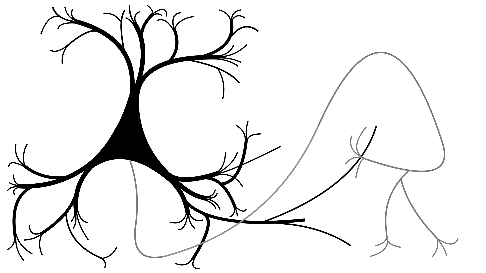

# neurons: High performance modeling tools in C++ with R interface

Neurons is an R/C++ package for simulating neurons and networks of neurons, currently under development at [Oviedo Lab](https://oviedolab.org/). The package is built around a few core object classes, all of which are a C++ class accessible through R via Rcpp modules and wrappers.

- **neuron**: For modeling the spiking of single neurons with dichotomized Gaussians. 
- **network**: For simulating spiking neural networks with Growth-transform dynamical systems.
- **motif**: For specifying general patterns of connectivity between neurons in a circuit, i.e., a "circuit motif" or "network topology".

  

Copyright (C) 2025, Michael Barkasi
barkasi@wustl.edu