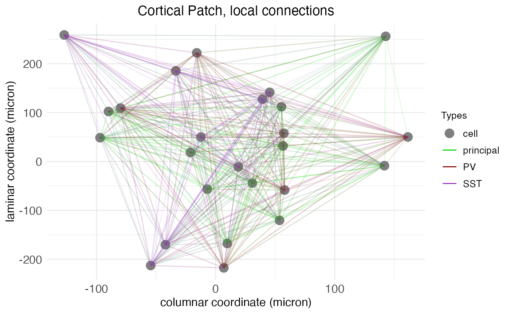
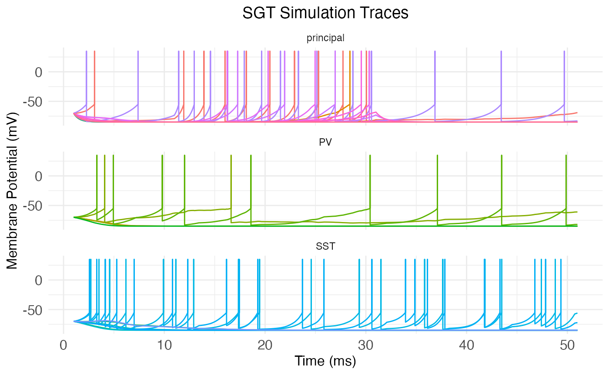
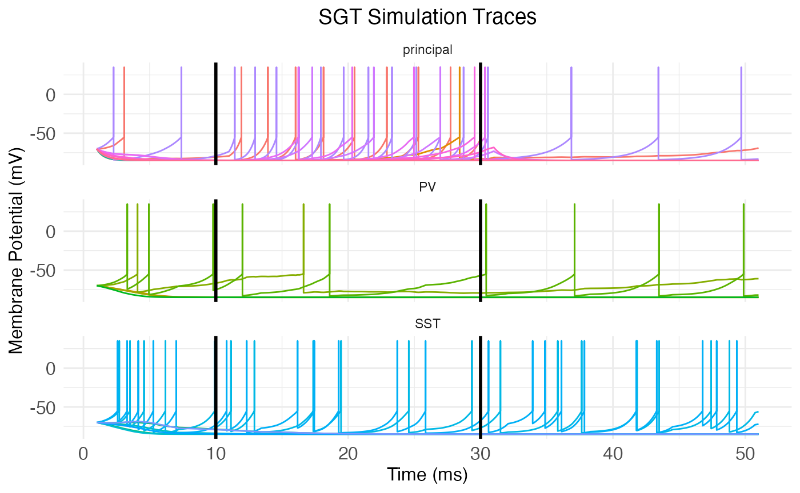

# Spatial growth-transform models

## Introduction

The simplest mathematical models of neural networks are built from
homogeneous McCulloch-Pitts neurons with scalar-weight connections
between them. Biological neural networks, such as those in patches of
cortex, are far more complex. They contain different types of neurons
each with their own electrical behavior and spatially extended
connections.

Computational neuroscientists standardly model biological neural
networks as [dynamical systems](https://philpapers.org/rec/ELIMBM-3).
[Growth-transform](https://doi.org/10.3389/fnins.2020.00425) (GT)
models, introduced by Gangopadhyay and Chakrabartty, are one example.
Instead of a one-dimensional weight between two homogeneous neurons, GT
models use both a transconductance parameter and a temporal modulation
factor to determine network behavior. Roughly, the transconductance
parameter is the inverse of a traditional weight, while the temporal
modulation factor allows for capturing the electrodynamics \partial
v/\partial t of different neuron types at a single spatial point.

The GT models implemented in this package add a third aspect of
biological realism not captured by the original formulation of
Gangopadhyay and Chakrabartty: a transmission velocity parameter for
each neuron type. While the temporal modulation factor controls membrane
voltage over time at a *single* spatial point, the transmission velocity
parameter determines the rate at which changes in membrane voltage
*propagate between neurons*. For this reason, we refer to our GT models
as *spatial GT* (SGT) models.

SGT models thus allow for network topologies that not only capture
connection strengths between neurons, but also the different types of
neurons and their electrodynamics across both time *and space*. A
[separate
tutorial](https://michaelbarkasi.github.io/neurons/articles/tutorial_network_topology.md)
demonstrates how to build network topologies for these models from
circuit motifs. This tutorial explains SGT models in more detail.

## Network nodes

Let’s set up the R environment by clearing the workspace, setting a
random-number generator seed, and loading the neurons package.

``` r
# Clear the R workspace to start fresh
rm(list = ls())

# Set seed for reproducibility
set.seed(12345) 

# Load neurons package
library(neurons, quietly = TRUE) 
```

Next, we create a new network object with the new.network function.

``` r
cortical.patch <- new.network()
```

The object initialized by new.network is a minimal single-node network.
In this context, “node” does not mean a single neuron, but rather a
cluster of nearby neurons with local recurrent connections. For this
tutorial, we will follow the topology of the node model of [Park and
Geffen (2020)](https://doi.org/10.1371/journal.pcbi.1008016), which
includes three distinct neuron types: excitatory principal pyramidal
neurons and two inhibitory types, parvalbumin (PV) and somatostatin
(SST) interneurons. This topology specifies that these nodes are
expected to be (approximately) fully connected, with cells of each type
synapsing into cells of all other types. (Note that while we keep the
topology and node structure of the Park and Geffen model, they use a
different dynamical systems framework to model spiking behavior.)


The basic structure of a local network node, as modeled by [Park and
Geffen (2020)](https://doi.org/10.1371/journal.pcbi.1008016).

At this low level of structure, nodes are defined by neuron types,
neuron type valence (1 for excitatory, -1 for inhibitory), node size
(mean number of neurons per type), and local connection density (the
average fraction of neurons in the node that connect to other neurons in
the same node). At the highest level of structure, network objects are
built from nodes arrayed into layers and columns, mimicking the
structure of the cortex – although in this tutorial we will only work
with a single node. The [network-topology
tutorial](https://michaelbarkasi.github.io/neurons/articles/tutorial_network_topology.md)
provides more details on making layer-column structure.

With a network initialized, both low and high-level structure is set
with the set.network.structure function. We will set up a fully
connected single-node network with the three cell types from the [Park
and Geffen (2020)](https://doi.org/10.1371/journal.pcbi.1008016) model,
with a mean count of 10, 5, and 5, respectively.

``` r
cortical.patch <- set.network.structure(
    cortical.patch,
    neuron_types = c("principal", "PV", "SST"),
    neurons_per_node = c(10, 5, 5),
    recurrence_factors = 0.75,
    pruning_threshold_factor = 0.1
  )
```

By default, the set.network.structure function sets the number of rows
and columns each to one, i.e., makes a single node, and initializes
local recurrent connections within that node. The argument
recurrence_factors is used to set the local connection density; in this
case, it’s set to 0.75, meaning each cell (in each layer-column
combination) connects to approximately three-quarters of the cells of
each type. The node we just created can be visualized with the
plot.network function:

``` r
plot.network(cortical.patch, cell_size_factor = 1.0)
```



As the axis labels indicate, SGT models assign to each neuron a 2D
spatial coordinate giving its location along the laminar and columnar
axes. These coordinates are continuous and real-valued and are used in
conjunction with the transmission velocity parameter to simulate spike
propagation.

## Spatial coordinates

As the axis labels in the previous plot also indicate, there is a
physically meaningful unit attached to these distances: microns. Four
parameters control the coordinates assigned to each neuron: column_width
(c\_{\mathrm{width}}), layer_height (l\_{\mathrm{height}}),
column_separation_factor (F\_{\mathrm{column}}), and
layer_separation_factor (F\_{\mathrm{layer}}). A node is created for
each combination of column integer-index c and layer integer-index l.
Each node is assigned a coordinate \langle x_c,y_l\rangle: x_c = c
\frac{c\_{\mathrm{width}}F\_{\mathrm{column}}}{2} y_l = l
\frac{l\_{\mathrm{height}}F\_{\mathrm{layer}}}{2} Within each node, a
coordinate \langle x_n,y_n\rangle is assigned to each neuron n by
sampling from a normal distribution: x_n \sim \mathcal{N}(x_c,
\frac{c\_{\mathrm{width}}}{2}) y_n \sim \mathcal{N}(y_l,
\frac{l\_{\mathrm{height}}}{2})

## Cell types

The three cell types (principal, PV, and SST) of the node are
pre-defined in the neurons package. To see all cell types known by the
package in the current session, we use the print.known.celltypes
function:

``` r
print.known.celltypes()
```

``` scroll-output
## Known cell types:
## 
## Type: VIP
##   Valence: -1
##   Temporal modulation bias: 0.001
##   Temporal modulation time constant: 1
##   Temporal modulation amplitude: 0.005
##   Transmission velocity: 30000
##   Potential bound (mV): 85
##   Metabolic energy derivative dHdv bound (mA): 1.05e-06
##   Spike current (mA): 1e-06
##   Coupling scaling factor: 1e-07
##   Spike potential (mV): 35
##   Resting potential (mV): -70
##   Threshold (mV): -55
## 
## Type: SST
##   Valence: -1
##   Temporal modulation bias: 0.001
##   Temporal modulation time constant: 1
##   Temporal modulation amplitude: 0.005
##   Transmission velocity: 24000
##   Potential bound (mV): 85
##   Metabolic energy derivative dHdv bound (mA): 1.05e-06
##   Spike current (mA): 1e-06
##   Coupling scaling factor: 1e-07
##   Spike potential (mV): 35
##   Resting potential (mV): -70
##   Threshold (mV): -55
## 
## Type: PV
##   Valence: -1
##   Temporal modulation bias: 0.001
##   Temporal modulation time constant: 1
##   Temporal modulation amplitude: 0.005
##   Transmission velocity: 36000
##   Potential bound (mV): 85
##   Metabolic energy derivative dHdv bound (mA): 1.05e-06
##   Spike current (mA): 1e-06
##   Coupling scaling factor: 1e-07
##   Spike potential (mV): 35
##   Resting potential (mV): -70
##   Threshold (mV): -55
## 
## Type: principal
##   Valence: 1
##   Temporal modulation bias: 0.001
##   Temporal modulation time constant: 1
##   Temporal modulation amplitude: 0
##   Transmission velocity: 30000
##   Potential bound (mV): 85
##   Metabolic energy derivative dHdv bound (mA): 1.05e-06
##   Spike current (mA): 1e-06
##   Coupling scaling factor: 1e-07
##   Spike potential (mV): 35
##   Resting potential (mV): -70
##   Threshold (mV): -55
```

As can be seen from the output, cell types are defined by a number of
parameters:

- *Valence:* 1 for excitatory cells, -1 for inhibitory cells. Code
  variable: valence.
- *Temporal modulation parameters:* The temporal modulation term T
  controlling the responsiveness (size) of \partial v/\partial t is
  determined by an exponential decay function with parameters:
  - *Temporal modulation bias:* The baseline value b of T, in ms. Code
    variable: temporal_modulation_bias.
  - *Temporal modulation time constant:* The time constant \tau of the
    exponential decay in T, in ms. Code variable:
    temporal_modulation_timeconstant.
  - *Temporal modulation amplitude:* The amplitude A of the exponential
    decay in T, in ms. Code variable: temporal_modulation_amplitude.
- *Transmission velocity:* The speed of the action potential between
  neurons, in microns/ms. Code variable: transmission_velocity.
- *Potential bound:* The maximum absolute value v\_\mathrm{bound} of
  potential difference in electrical charge between the inside and
  outside of the cell, in mV. Code variable v_bound. Theoretically, we
  assume this is the absolute value of the rest voltage, plus a little
  bit. All that really matters is that -v\_\mathrm{bound} \leq v \leq
  v\_\mathrm{bound} for all possible membrane potentials v.
- *Metabolic energy derivative bound:* Bound \partial I\_\mathrm{influx}
  on the absolute value of the derivative \partial\mathcal{H}/\partial v
  of metabolic energy \mathcal{H} with respect to potential v, such that
  \partial I\_\mathrm{influx} \geq \|\partial\mathcal{H}/\partial v\|,
  in mA. Code variable: dHdv_bound. Theoretically, we assume that this
  value is the change in current required to initiate a spike.
- *Spike current:* The current of the action potential, i.e., the
  current crossing the membrane at a spot as a spike passes, in mA. Code
  variable: I_spike.
- *Coupling scaling factor* A unit-free scalar value controlling how
  power used in synaptic transmission compares to that used in spiking.
  Code variable: coupling_scaling_factor.
- *Spike potential:* The value v\_\mathrm{spike} of an action potential,
  in mV. Code variable: spike_potential.
- *Resting potential:* The potential difference v\_\mathrm{rest} in
  electrical charge between the inside and outside of the cell at rest,
  in mV. Code variable: resting_potential.
- *Threshold:* The potential difference v\_\mathrm{threshold} in
  electrical charge between the inside and outside of the cell at which
  an action potential is triggered, in mV. Code variable: threshold.

Notice that these are mostly biophysically interpretable parameters
which can be set with, or tested against, experimental data.

Cell types themselves are technically a C++ struc. Defined cell types
are stored in an unordered map in C++ that’s accessible via three R
wrapper functions. The function add.cell.type can be used to add a new
cell type to the map. The function modify.cell.type can be used to
modify an existing cell type. The function fetch.cell.type.params will
return the parameters of the named cell type as an R list.

## SGT simulations

The function run.SGT runs a simulation of spiking activity across a
network using a SGT model. The function is just a wrapper over the SGT
method of C++ network objects. It takes three arguments:

1.  network: A network created by the new.network function and
    structured by the set.network.structure function.
2.  stimulus_current_matrix: A matrix of input currents (in mA) over the
    duration of the simulation, rows representing neurons and columns
    representing time bins.
3.  dt: Time-step size for simulation, in ms. Default is 1\mathrm{e}-3.

The number of columns of stimulus_current_matrix determines the length
of the simulation. In essence, the function run.SGT answers the
question: How would the network respond to this stimulus current over
this amount of time?

For example, let’s create a 50ms simulation for the node we created
above. To fashion a stimulus current matrix, we first need to figure out
how many neurons are in our single-node network:

``` r
cortical.patch.comps <- cortical.patch$fetch_network_components()
n_neurons <- cortical.patch.comps$n_neurons
cat("Number of neurons in the network:", n_neurons)
```

``` scroll-output
## Number of neurons in the network: 25
```

This gives us the number of rows needed in our stimulus current matrix.
For the number of columns, we need to know the number of time steps
required:

``` r
stim_time_ms <- 50
dt <- 1e-3
n_steps <- stim_time_ms/dt
cat("Number of time steps in the simulation:", n_steps)
```

``` scroll-output
## Number of time steps in the simulation: 50000
```

Now, suppose we want our simulation to involve a 20ms input current to
just the principal neurons, starting at 10ms. We can compute the initial
and final time steps of this current, plus a mask for the principal
neurons, as follows:

``` r
# Set stimulus start and length
stim_length_ms <- 20
stim_start_ms <- 10
# Find start and end steps of the input stimulus current
stim_length <- stim_length_ms / dt
stim_start <- stim_start_ms / dt 
stim_end <- stim_start + stim_length - 1
# Find mask for principal neurons
principal_mask <- cortical.patch.comps$neuron_type_name == "principal"
```

A final question is how much current to apply. For this simulation,
we’ll use a constant current of one pico amp (1\mathrm{e}-9mA) to the
principal neurons during the stimulus period. It might be natural to
leave the input current at zero outside of the stimulus period, but
there is endogenous background activity even without exogenous input to
the network. So, we’ll specify a baseline input current of 0.1 pico amps
(1\mathrm{e}-10mA) to all neurons throughout the entire stimulation
period:

``` r
rest_current <- 1e-10 # 0.1 pico amp
stimulus_current_matrix <- matrix(rest_current, nrow = n_neurons, ncol = n_steps)
stimulus_current_matrix[principal_mask, stim_start:stim_end] <- 1e-9 # one pico amp
```

With the stimulus current matrix in hand, we can run the simulation:

``` r
sim_results <- run.SGT(
    cortical.patch,
    stimulus_current_matrix,
    dt
  )
```

The result of the function run.SGT is a matrix of spike traces formatted
similar to stimulus_current_matrix: each row represents a neuron and
each column represents a time step from the simulation. Each entry is
the membrane potential of the neuron at that time bin, in mV. The order
of neurons and time steps matches across the input stimulus-current and
output spike-trace matrices, of course. In addition, a vector of spike
counts for each neuron (giving the number of times each neuron spiked)
in the network is also returned. Both are returned in a list of two
elements, sim_traces and spike_counts.

We can view the head of the simulation traces:

``` r
print(sim_results$sim_traces[1:10,1:10])
```

``` scroll-output
##       [,1]      [,2]      [,3]      [,4]      [,5]      [,6]      [,7]      [,8]      [,9]     [,10]
##  [1,]  -70 -70.00141 -70.00281 -70.00421 -70.00560 -70.00699 -70.00837 -70.00974 -70.01109 -70.01243
##  [2,]  -70 -70.02832 -70.05659 -70.08481 -70.11298 -70.14109 -70.16916 -70.19717 -70.22512 -70.25302
##  [3,]  -70 -69.99523 -69.99046 -69.98569 -69.98092 -69.97614 -69.97137 -69.96659 -69.96181 -69.95703
##  [4,]  -70 -70.00984 -70.01967 -70.02950 -70.03931 -70.04912 -70.05890 -70.06867 -70.07842 -70.08815
##  [5,]  -70 -70.00973 -70.01945 -70.02917 -70.03888 -70.04858 -70.05828 -70.06797 -70.07764 -70.08730
##  [6,]  -70 -70.01363 -70.02725 -70.04086 -70.05446 -70.06803 -70.08159 -70.09512 -70.10863 -70.12211
##  [7,]  -70 -70.01555 -70.03108 -70.04660 -70.06210 -70.07758 -70.09305 -70.10849 -70.12391 -70.13930
##  [8,]  -70 -70.02320 -70.04638 -70.06951 -70.09261 -70.11568 -70.13871 -70.16169 -70.18464 -70.20755
##  [9,]  -70 -70.02031 -70.04059 -70.06084 -70.08108 -70.10128 -70.12146 -70.14160 -70.16172 -70.18181
## [10,]  -70 -70.02921 -70.05836 -70.08747 -70.11652 -70.14552 -70.17447 -70.20336 -70.23220 -70.26099
```

As well as the head of the spike counts:

``` r
print(head(sim_results$spike_counts))
```

``` scroll-output
## [1] 10  0 17  3  4  1
```

The neurons package also includes the function plot.network.traces,
which takes a network object with a trace matrix and produces a plot of
the traces, putting all neurons of the same type together.

``` r
plot.network.traces(cortical.patch)
```



We can manually add the start and end of the stimulus period to the plot
with vertical lines:

``` r
plt <- plot.network.traces(cortical.patch, return_plot = TRUE)  +
  ggplot2::geom_vline(xintercept = stim_end * dt, linewidth = 1) +
  ggplot2::geom_vline(xintercept = stim_start * dt, linewidth = 1)
print(plt)
```



Notice how there’s spontaneous spiking throughout the simulation time,
not just during the stimulus period. This is both because of the rest
current being injected into all cells, and because of recurrent
connections between the cells. Also note that the cells are not all
firing synchronously. This is both because of the stochastic connections
and connection weights between cells, but also (and more importantly,
for a network this small) because of the temporal delay from spatial
distance between neurons. Finally, notice the different spiking
behaviors. The principal neurons largly fire in a tonic, i.e., rhythmic
manner, while the inhibitory interneurons (the PV and SST) fire in
bursts. This difference is directly due to the difference in temporal
modulation amplitude: An amplitude of zero leads to no bursting, while
positive non-zero amplitude creates a bursting pattern.

## Mathematics of SGT models

GT models are hybrids, in so far as they directly model *subthreshold*
membrane potential dynamics, while leaving out any mechanistic modeling
of spikes themselves. Instead, spikes are modeled as a constant and
instantaneous value v\_\mathrm{spike} (variable spike_potential in the
simulation) added to the subthreshold dynamics when the spike threshold
is crossed. Thus, what follows is an explanation of the subthreshold
component of membrane potential v, although we leave the qualifier
“subthreshold” implicit.

Suppose our network has n neurons N. We want to run a simulation of the
membrane potential v(t) of each neuron N over time t. Naturally, the
system evolves so that: v(t+1) = v(t) + \left.\frac{\partial v}{\partial
t}\right\|\_{t+1} The hard part, of course, is to compute \partial
v/\partial t. That is, how do membrane potentials evolve over time?

### Power minimization

GT models tackle this question with a minimization principle: \partial
v/\partial t is always such that the system minimizes net (metabolic)
power \mathcal{H}: \frac{\partial\mathcal{H}}{\partial v}\frac{\partial
v}{\partial t} \leq 0 For simplicity, let us assume that
\partial\mathcal{H}/\partial t = 0, i.e., that the metabolic power is
not changing over time.

It’s plausible that the membrane potential v is a scalar multiple
fv\_\mathrm{rest} of the resting potential v\_\mathrm{rest}, where the
scale factor f is a function of \partial\mathcal{H}/\partial v. In other
words, we assume that the scale factor f depends on how a small change
\partial v in membrane potential would change the metabolic power
\mathcal{H}. Hence, we have that: v(t+1) = v(t) + \left.\frac{\partial
v}{\partial t}\right\|\_{t+1} =
f\left(\left.\frac{\partial\mathcal{H}}{\partial
v}\right\|\_{t+1}\right)v\_\mathrm{rest} Actually, in practice
[Gangopadhyay and
Chakrabartty](https://doi.org/10.3389/fnins.2020.00425) assume that the
quantity of which v is a multiple is a positive value v\_\mathrm{bound}.
The only constraint on this value is that it must bound v from above and
below, i.e., -v\_\mathrm{bound} \leq v \leq v\_\mathrm{bound}. Thus, it
would be more mathematically accurate to say that v is a scalar multiple
of the absolute value of v\_\mathrm{rest}. Within the simulation code,
the relevant variable is v_bound with a default value of 85 mV, slightly
higher than the absolute value of v\_\mathrm{rest}.

### Scale factor

Therefore, if we could find a suitable scale factor f, we’d be able to
compute \partial v/\partial t as: \left.\frac{\partial v}{\partial
t}\right\|\_t = f\left(\left.\frac{\partial\mathcal{H}}{\partial
v}\right\|\_{t}\right)v\_\mathrm{rest} - v(t-1) Combining the previous
equation with the minimization assumption, we have:
\frac{\partial\mathcal{H}}{\partial v}
\left(f\left(\left.\frac{\partial\mathcal{H}}{\partial
v}\right\|\_t\right)v\_\mathrm{rest} - v(t-1) \right) = 0 Assuming
\partial\mathcal{H}/\partial v \neq 0, this equation implies that:
v(t-1) = f\left(\left.\frac{\partial\mathcal{H}}{\partial
v}\right\|\_t\right)v\_\mathrm{rest} And so:
f\left(\left.\frac{\partial\mathcal{H}}{\partial v}\right\|\_t\right) =
\frac{v(t-1)}{v\_\mathrm{rest}} Hence, we see that f is a function of
the metabolic power gradient \partial\mathcal{H}/\partial v that’s equal
to the ratio of v over the rest potential v\_\mathrm{rest}. An immediate
consequence is that, when v\approx v\_\mathrm{rest}, the scale factor f
is approximately 1.

Notice that this derivation implies that \partial v/\partial t=0, which
may seem obviously wrong. However, we are attempting to derive a formula
for \partial v/\partial t which makes \partial\mathcal{H}/\partial t=0.
The “makes” is aspirational: of course, \partial v/\partial t\neq 0,
but, what general form of \partial v/\partial t will tend to make
\partial\mathcal{H}/\partial t=0 over time? In terms of biology, we can
alternatively think of the system as *trying* to maintain a stable rest
voltage v\_\mathrm{rest}, and the question is: what form of \partial
v/\partial t will best achieve this goal?

### Rest vs spike power

In order to solve for f, it’s helpful to think about the metabolic power
gradient \partial\mathcal{H}/\partial v and how it relates to two
quantities: the metabolic power \mathcal{H}\_\mathrm{rest} of
maintaining rest potential v\_\mathrm{rest} and the metabolic power
\mathcal{H}\_\mathrm{spike} of initiating a spike under the conditions
which hold at time t. At least as a linear approximation, we have that:
\mathcal{H}\_\mathrm{rest} =
v\_\mathrm{rest}\left.\frac{\partial\mathcal{H}}{\partial v}\right\|\_t
This equation is justified because the metabolic power
\mathcal{H}\_\mathrm{rest} of maintaining rest potential
v\_\mathrm{rest} is equal to the power used to maintain the negative
potential v\_\mathrm{rest} under the natural positive flow of charge
into the cell. Unit analysis (\mathrm{Watts} = \mathrm{Volts} \times
\mathrm{Ampere}) implies that this latter quantity must be the energy
gradient \partial\mathcal{H}/\partial v evaluated at t.

What about the metabolic power \mathcal{H}\_\mathrm{spike} of initiating
a spike? If v\_\mathrm{threshold} is the membrane potential at spike
threshold, then (by the above unit analysis) the change \partial
I\_\mathrm{influx} in current I across the membrane at spike initiation
is: \partial I\_\mathrm{influx} =
\left.\frac{\partial\mathcal{H}}{\partial
v}\right\|\_{v\_\mathrm{threshold}} and the metabolic power required to
produce a spike is approximately: \mathcal{H}\_\mathrm{spike} =
v\partial I\_\mathrm{influx}

The values \mathcal{H}\_\mathrm{rest} and \mathcal{H}\_\mathrm{spike}
are helpful because, at any moment t, whether there is a spike depends
on how they relate. If \mathcal{H}\_\mathrm{spike} \<
\mathcal{H}\_\mathrm{rest}, then the neuron will be more inclined to
spike. Under this assumption, we can suppose that f is a function of the
difference between \mathcal{H}\_\mathrm{spike} and
\mathcal{H}\_\mathrm{rest}: \begin{aligned}
f\left(\left.\frac{\partial\mathcal{H}}{\partial v}\right\|\_t\right) &=
f\left(\mathcal{H}\_\mathrm{spike} - \mathcal{H}\_\mathrm{rest}\right)
\\ &= f\left(v\partial I\_\mathrm{influx} -
v\_\mathrm{rest}\left.\frac{\partial\mathcal{H}}{\partial
v}\right\|\_t\right) \end{aligned} A suitable function f follows from
the previously cited lemma that f\approx 1 when v\approx
v\_\mathrm{rest}. A plausible way to achieve this result without f
collapsing into a trivial constant is to set: f = \frac{ v\partial
I\_\mathrm{influx} -
v\_\mathrm{rest}\left.\frac{\partial\mathcal{H}}{\partial v}\right\|\_t
}{ v\_\mathrm{rest}\partial I\_\mathrm{influx} -
v\left.\frac{\partial\mathcal{H}}{\partial v}\right\|\_t }

### Interpretation

While the motivation for this definition of f is mathematical (we want
f\approx 1 when v\approx v\_\mathrm{rest}), the equation makes some
biological sense. We have already discussed the numerator:
v\_\mathrm{rest}\left.\partial\mathcal{H}/\partial v\right\|\_t is the
metabolic power \mathcal{H}\_\mathrm{rest} of maintaining rest potential
v\_\mathrm{rest} under current influx at time t, v\partial
I\_\mathrm{influx} is the metabolic power \mathcal{H}\_\mathrm{spike} of
initiating a spike under that same condition, and their difference
signals whether it takes more metabolic power to spike or maintain rest.

In the denominator, v\_\mathrm{rest}\partial I\_\mathrm{influx} is the
metabolic power of initiating a spike from the rest potential, while
v\left.\partial\mathcal{H}/\partial v\right\|\_t is the metabolic power
of maintaining the potential v(t) under the current influx
\left.\partial\mathcal{H}/\partial v\right\|\_t holding at time t.
Hence, the difference between these two quantities is the amount of
additional metabolic power needed to (hypothetically) initiate a spike
from rest, compared to the power needed to maintain the cell’s present
state.

Thus, the denominator provides a kind of upper bound, or normalization.
The scale factor f is plausibly interpreted as the additional power
needed to spike (vs maintain rest potential) as a fraction of the max
possible power needed to initiate a spike. It gives a normalized “cost”
of the power (and hence energy) for a spike.

### Power gradient

Returning to \partial v/\partial t, we have: \left.\frac{\partial
v}{\partial t}\right\|\_t = v\_\mathrm{rest} \left( \frac{ v\partial
I\_\mathrm{influx} -
v\_\mathrm{rest}\left.\frac{\partial\mathcal{H}}{\partial v}\right\|\_t
}{ v\_\mathrm{rest}\partial I\_\mathrm{influx} -
v\left.\frac{\partial\mathcal{H}}{\partial v}\right\|\_t }\right) -
v(t-1) This is equation given by [Gangopadhyay and
Chakrabartty](https://doi.org/10.3389/fnins.2020.00425) for GT models.
It ensures the minimization condition that \partial\mathcal{H}/\partial
t = 0.

How do we determine \partial I\_\mathrm{influx}? Well, \partial
I\_\mathrm{influx} is the change in current I across the membrane at
spike initiation. Following Gangopadhyay and Chakrabartty, we will treat
it as a constant empirical parameter that bounds the power gradient,
i.e., \partial I\_\mathrm{influx} \geq
\left.\partial\mathcal{H}/\partial v\right\|\_t for all t. This
treatment is plausible, as presumably the moment of spike initiation
involves the largest change in membrane current a neuron will
experience.

Second, how do we determine \partial\mathcal{H}/\partial v? Intuitively
(and, as before, following Gangopadhyay and Chakrabartty), we have:
\frac{\partial\mathcal{H}}{\partial v} =
I\_\mathrm{synaptic\\transmission} - I\_\mathrm{stimulus\\input} +
I\_\mathrm{spike} In this equation, I\_\mathrm{synaptic\\transmission}
is the input current induced by synaptic transmission across all
synapses, I\_\mathrm{stimulus\\input} gives the input current to each
neuron from outside stimuli, and I\_\mathrm{spike} gives the spike
current (if any). The stimulus input I\_\mathrm{stimulus\\input} is
what’s specified by the simulation variable stimulus_current_matrix. The
spike current I\_\mathrm{spike} is determined by simple thresholding:
I\_\mathrm{spike}=0 if v \< v\_\mathrm{threshold} and otherwise is equal
to the value of the simulation variable I_spike for the cell type.

### Membrane potential reset

Notice that unlike a leaky integrate-and-fire neuron, the definition of
\partial v/\partial t itself produces the reset after a spike. When v is
very near the threshold v\_\mathrm{threshold}, then (by the definition
given above) we have that \partial I\_\mathrm{influx} =
\left.\partial\mathcal{H}/\partial v \right\|\_{v\_\mathrm{threshold}},
and hence f\approx -1 (because, in general, (x-y)/(y-x)=-1). Thus, when
v\approx v\_\mathrm{threshold}, \partial v/\partial t\approx
-v\_\mathrm{rest} - v\_\mathrm{threshold}. Hence,
v\_\mathrm{threshold} + \partial v/\partial t \approx -v\_\mathrm{rest}.
However, recall that the actual math for the model uses
v\_\mathrm{bound}=\|v\_\mathrm{rest}\| + \epsilon for some small
\epsilon, so that v\_\mathrm{threshold} + \partial v/\partial t \approx
-v\_\mathrm{bound} \approx v\_\mathrm{rest}. Thus, the model produces a
reset to a value near the rest potential after a spike, without any
explicit reset mechanism.

### Spatial lag

What about I\_\mathrm{synaptic\\transmission}, the input current induced
by synaptic transmission across all synapses? We assume that the induced
post-synaptic current is equal to the inducing pre-synaptic potential,
modulated by the synaptic conduction. However, the complicating factor
is that, given spatial distance between cells and synaptic transmission
time, the relevant pre-synaptic potential v at time t from pre-synaptic
neuron N may not be v(t), but rather v(t^\prime) for some t^\prime \< t.

Let \vec{v} = \langle v_1, v_2, \ldots, v_n\rangle be the vector of
membrane potentials for all n neurons in the network at time t. Further,
let V be a n\times n time-dependent matrix which captures how each
neuron “sees” the others. Specifically, V\_{ij}(t) is the membrane
potential of neuron N_i that reaches neuron N_j at time t. Then,
assuming Q is an n\times n matrix of synaptic connections such that
Q\_{ij} is the conductance from neuron j to neuron i, we have that:
I\_\mathrm{synaptic\\transmission}(N_i) = \sum\_{j=1}^n
Q\_{ij}V\_{ji}(t)

### Spiking without spikes?

As noted above, GT models are only ever modelling *subthreshold*
dynamics. That is, v represents only the membrane potential below the
spike threshold. This arrangement leads to an awkward interpretation of
the equation just given for I\_\mathrm{synaptic\\transmission}.
Specifically, this equation implies that it’s the subthreshold membrane
potential of the presynaptic neuron which is transduced across the
synapse to the postsynaptic neuron. Biologically, signal transduction at
synapses happens primarily through spikes, of course. So, two questions
naturally arise:

1.  If it’s the subthreshold membrane potential v which drives synaptic
    transmission in a GT model, how do the spikes themselves have any
    causal role in signal transmission?
2.  Whatever the answer to the first question, why arrange a spiking
    neural network model in this strange way?

The answer to the first question is that, in GT models, spikes of
pre-synaptic neurons causally affect the membrane potential of
postsynaptic neurons indirectly, via their effect on the subthreshold
membrane potential of the pre-synaptic neuron. This is, of course, the
inverse of the causal flow in the real biology. In real neurons, changes
in subthreshold membrane potential cause spikes, which cause synaptic
transmission. In GT models, the energy cost of a future spike causes
changes in the subthreshold membrane potential, which itself is engaged
in continuous synaptic transmission. Mathematically, that future energy
cost appears as the term I\_\mathrm{spike} in the metabolic power
gradient \partial\mathcal{H}/\partial v, and as the term
\mathcal{H}\_\mathrm{spike} in the scale factor f.

As for the second question, the advantage of flipping the causal order
and modelling the energy cost of a spike instead of a spike itself is
that it makes it easier to optimize the synaptic “weights”, i.e., the
matrix Q of synaptic conductances, so that the network model reproduces
a desired response v for a given stimulus input current
I\_\mathrm{stimulus\\input}. Traditionally spiking neural networks are
trained by optimizing synaptic weights to minimize the difference
between some time-dependent desired spike rate and the model spike rate.
However, if R(w,t,n) is the spike rate implied by a spiking neural
network for neuron n at time t under synaptic weights w, R will not
usually be differentiable due to spiking being a function of discrete
threshold crossings. This means that spiking neural networks can’t
straightforwardly be trained using gradient descent. In contrast,
\mathcal{H} is a continuous function of v with a well defined derivative
\partial\mathcal{H}/\partial v, and v itself, being only the
subthreshold membrane potential, is also smooth.

### Temporal modulation

The final step in GT models (including SGT models) is to divide the rate
of change for membrane potential \partial v/\partial t by a temporal
modulation term T, such that: v(t+1) = v(t) + \frac{\left.\frac{\partial
v}{\partial t}\right\|\_{t+1}}{T} This term T is given by the following
exponential decay model: T = b + A\exp\left(-\frac{x}{\tau}\right) where
b is the temporal modulation bias, A is the temporal modulation
amplitude, and \tau is the temporal modulation time constant. The
traditional input x is filled by B, a “burst” step counter. The step
counter B is merely a numerical device in the simulation to carry T
repeatedly across the exponential decay via the input x. When T\<b, B
resets to zero (and thus T jumps again to a high number), resetting the
exponential decay.

When the amplitude A is zero, the exponential decay has no effect and
all that’s relevant is the bias b. When A\>0, the effect is to increase
T at the start of the step counter, thereby shrinking the effect of
\partial v/\partial t. This shrinkage follows the exponential decay of
T, so that there is little chance in v (i.e., small \partial v/\partial
t) at the start of the step counter, but the possibility for large
changes in v at the end of the step counter. Thus, when at the end of
the step counter, neurons are prone to many spikes as their membrane
potential rapidly changes, creating a bursting effect.
