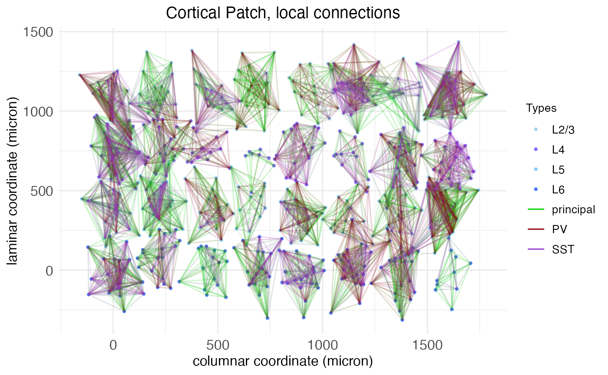
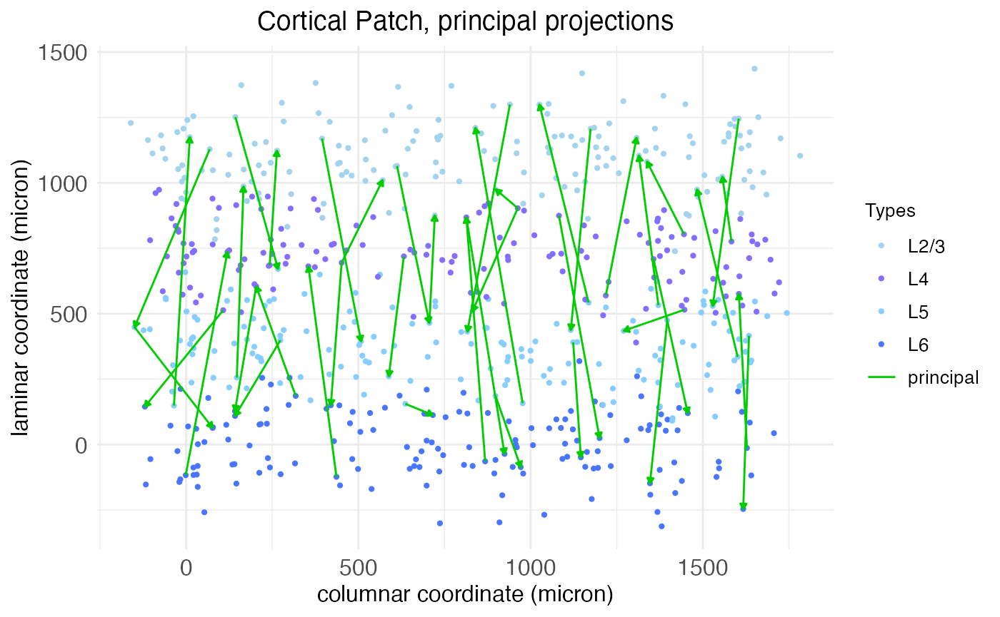
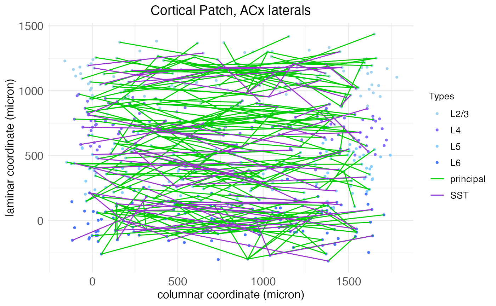
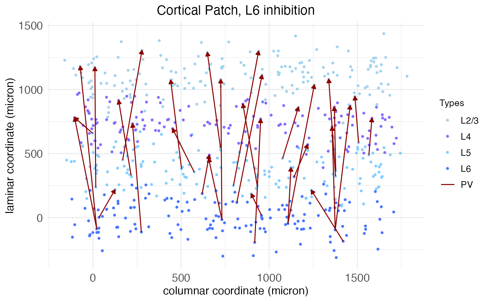

# Network topology from circuit motifs

## Introduction

The simplest mathematical models of neural networks are built from
homogeneous McCulloch-Pitts neurons and scalar-weight connections
between them. Biological neural networks, such as those in patches of
cortex, are far more complex. They contain different types of neurons
each with their own electrical behavior and spatially extended
connections.

Computational neuroscientists standardly model biological neural
networks as [dynamical systems](https://philpapers.org/rec/ELIMBM-3).
The *spatial growth-transform* (SGT) models used in this package, based
on the GT models of [Gangopadhyay and
Chakrabartty](https://doi.org/10.3389/fnins.2020.00425), are one such
example. Instead of a one-dimensional weight between two homogeneous
neurons, SGT models use a transconductance parameter, a temporal
modulation factor, and a transmission velocity parameter to determine
network behavior. Roughly, the transconductance parameter is the inverse
of a traditional weight, while the temporal modulation factor allows for
capturing the different electrodynamics of different neuron types at a
single spatial point and the transmission velocity parameter allows for
modeling the spatial propagation of signals between neurons.

SGT models thus allow for network topologies that not only capture
connection strengths between neurons, but also the different types of
neurons and their electrodynamics over time and space. A [separate
tutorial](https://michaelbarkasi.github.io/neurons/articles/tutorial_SGT.md)
explains SGT models in more detail. This tutorial demonstrates how to
build network topologies for these models from circuit motifs.

## Initialize network

Let’s set up the R environment by clearing the workspace, setting a
random-number generator seed, and loading the neurons package.

``` r
# Clear the R workspace to start fresh
rm(list = ls())

# Set seed for reproducibility
set.seed(12345) 

# Load neurons package
library(neurons) 
```

Network topologies are held in a special class of objects, network, from
the neurons package. A new network object can be created with the
new.network function.

``` r
cortical.patch <- new.network()
```

As with the neuron object class, the network object class is native to
C++ and integrated into neurons (an R package) via Rcpp. The object
initialized by new.network is a minimal “single node” network. In this
context, “node” does not mean a single neuron, but rather a cluster of
nearby neurons with local recurrent connections. For this tutorial, we
will follow the node model of [Park and Geffen
(2020)](https://doi.org/10.1371/journal.pcbi.1008016), which includes
three distinct neuron types: excitatory principal pyramidal neurons and
two inhibitory types, parvalbumin (PV) and somatostatin (SST)
interneurons. These nodes are expected to be (approximately) fully
connected, with cells of each type synapsing into cells of all other
types.


The basic structure of a local network node, as modeled by [Park and
Geffen (2020)](https://doi.org/10.1371/journal.pcbi.1008016).

At this low-level of structure, nodes are defined by neuron types,
neuron type valence (1 for excitatory, -1 for inhibitory), node size
(mean number of neurons per type), and local connectivity density (the
average fraction of neurons in the node that connect to other neurons in
the same node). At the highest level of structure, network objects are
built from nodes arrayed into layers and columns, mimicking the
structure of the cortex. Hence, these networks can be thought of as
cortical patches.

With a network initialized, both low and high-level structure is set
with the set.network.structure function. To capture the topology of the
Park and Geffen node model, we will create nodes with three cell types
(principal, PV, and SST), with a mean count of 10, 5, and 5,
respectively. These three cell types (along with VIP interneurons) are
pre-defined by the neurons package; the process of loading and setting
cell types is discussed in the [tutorial on SGT
models](https://michaelbarkasi.github.io/neurons/articles/tutorial_SGT.md).
To mimic the major functional areas of the auditory cortex, we create a
cortical patch with four layers (L6, L5, L4, and L2/3).

``` r
cortical.patch <- set.network.structure(
    cortical.patch,
    neuron_types = c("principal", "PV", "SST"),
    layer_names = c("L6", "L5", "L4", "L2/3"),
    n_columns = 8,
    neurons_per_node = c(10, 5, 5)
  )
```

Notice that we chose to create a network with eight columns. Given the
default spatial size parameters of the set.network.structure function, a
patch with eight columns will be approximately the size of the auditory
cortex in mice.

More specifically, the networks used by SGT models assign to each neuron
a 2D spatial coordinate giving its location along the columnar and
laminar axis. These coordinates are continuous and real-valued and are
used in conjunction with the transmission velocity parameter simulate
spike propagation. There is a physically meaningful unit attached to
these coordinates: microns. Four parameters control the coordinates
assigned to each neuron: column_width c\_{\mathrm{width}}, layer_height
l\_{\mathrm{height}}, column_separation_factor F\_{\mathrm{column}}, and
layer_separation_factor F\_{\mathrm{layer}}. A node is created for each
combination of column integer-index c and layer l. Each node is assigned
a coordinate \langle x_c,y_l\rangle: x_c = c
\frac{c\_{\mathrm{width}}F\_{\mathrm{column}}}{2} y_l = l
\frac{l\_{\mathrm{height}}F\_{\mathrm{layer}}}{2} Within each node, a
coordinate \langle x_n,y_n\rangle is assigned to each neuron n by
sampling from a normal distribution: x_n \sim \mathcal{N}(x_c,
\frac{c\_{\mathrm{width}}}{2}) y_n \sim \mathcal{N}(y_l,
\frac{l\_{\mathrm{height}}}{2}) By default, c\_{\mathrm{width}} = 130.0,
l\_{\mathrm{height}} = 250.0, F\_{\mathrm{column}} = 3.5, and
F\_{\mathrm{layer}} = 3.0.

The set.network.structure function not only sets the number of rows and
columns and all spatial coordinates, but also initializes local
recurrent connections within each layer. In the code above, the default
connection density value of 0.5 was used, meaning each cell (in each
layer) connects to approximately half the cells of each type.

The plot.network function will visualize a network object. By default,
it displays only local recurrent connections within each node.

``` r
plot.network(cortical.patch)
```



Now we have a network of four cortical layers and eight columns, but
with only local connections between neighboring neurons. Next, we will
add long-range connections between layers and columns using circuit
motifs.

## Define and load motifs

A circuit motif, represented in the neurons package by special objects
of class motif, is a predefined pattern of connections between layers
and columns in a network. It is a recipe for connecting cells between
nodes, based on cell type, pre and post-synaptic node coordinates
(column and layer), and connection density (i.e., what ratio of cells in
a pre-synaptic node project to what ratio of cells in a post-synaptic
node).

Below we will define and load three canonical circuit motifs thought to
characterize sensory cortex: (1) an intracortical and intracolumnar
excitatory projection motif of principal columnar projections, (2) a
lateral projection motif for cross-columnar communication in the
auditory cortex, and (3) a translaminar L5/6 PV arborization motif for
intracolumnar inhibition. These motifs are summarized in the figure
below.


Three canonical sensory cortex circuit motifs, as described by [Harris
and Mrsic-Flogel (2013)](https://doi.org/10.1038/nature12654), [Park and
Geffen (2020)](https://doi.org/10.1371/journal.pcbi.1008016), [Bortone
et al. (2014)](https://doi.org/10.1016/j.neuron.2014.02.021), and
[Frandolig et al. (2019)](https://doi.org/10.1016/j.celrep.2019.08.048).

As shown by the figure, these motifs are “columnar”, in the sense that
they are defined relative to a single cortical column and repeated
across all columns.

### Principal columnar projections

The new.motif function initializes an empty motif object. Let’s
initialize one to model the canonical intracortical and intracolumnar
excitatory projections in the sensory cortex. These connections are
largely what defines a “column” in the cortex, and thus they connect
neurons in different layers while staying within the same column.

``` r
motif.pp <- new.motif(motif_name = "principal projections")
```

Connections between layers can then be added to the motif using the
load.projection.into.motif function. This function takes as arguments
the motif object, the source layer name, and the target layer. By
default, it generates excitatory projections between those layers with
both pre and post-synaptic density of 0.5, meaning that (on average)
half of the neurons in the source layer will send projections to the
target layer, and (on average) each pre-synaptic neuron will connect to
half of the neurons in the target layer. The ratio is “on average”
because the function determines the number of pre and post-synaptic
neurons by drawing from a Poisson distribution with mean equal to the
number of neurons in the node times the density. This density can be
modified via a fourth argument to the function. Here, for example, we
load a projection with density 0.9 from layer L4 to layer L2/3 into our
new motif:

``` r
motif.pp <- load.projection.into.motif(motif.pp, "L4", "L2/3", 0.9)
```

We have increased the density of this connection from the default
because layer 4 (the primary site of input from outside the cortex into
the cortex) sends a plurality of its intra-cortical projections to layer
2/3. By default, the loaded projection is between excitatory
(“principal”) neurons. Below we will show how the pre and post-synaptic
cell types can be modified through additional function arguments. For
now, let’s load sparse projections from layer 4 into the other layers:

``` r
motif.pp <- load.projection.into.motif(motif.pp, "L4", "L5", 0.25)
motif.pp <- load.projection.into.motif(motif.pp, "L4", "L6", 0.25)
```

The column-defining principle projections also typically include
recurrent loops between layer 2/3 and layer 5:

``` r
motif.pp <- load.projection.into.motif(motif.pp, "L2/3", "L5")
motif.pp <- load.projection.into.motif(motif.pp, "L5", "L2/3")
```

Finally, these projections also include a feed-forward projection from
layer 5 to layer 6, and a feedback projection from layer 6 to layer 4:

``` r
motif.pp <- load.projection.into.motif(motif.pp, "L5", "L6", 0.25)
motif.pp <- load.projection.into.motif(motif.pp, "L6", "L4", 0.25)
```

With the complete principle-projection motif defined, we apply it using
the apply.circuit.motif function. This function takes as arguments the
network object and the motif object. It adds the connections defined in
the motif to the network.

``` r
cortical.patch <- apply.circuit.motif(
    cortical.patch,
    motif.pp
  )
```

We can then visualize the new connections with the plot.network
function, specifying the motif name to plot the connections defined by
that motif.

``` r
plot.network(cortical.patch, plot_motif = "principal projections")
```



Note the arrow heads indicating the direction of the projection (pre vs
post-synaptic neuron). These scale with the number of projects to plot,
shrinking to accomodate more projections.

### Auditory lateral projections

Within sensory cortex, cortical columns tend to respond to a single type
of stimulus. For example, cortical columns in the visual cortex might
have preferred edge orientations while columns in the auditory cortex
prefer certain sound frequencies. More advanced cortical computations
require integrating input from a range of stimuli (e.g., a range of edge
orientations or sound frequencies), and thus there must be some
mechanism of column cross-talk. This is thought to be accomplished by
lateral connections between cells of the same layer, but different
columns. For example, [Park and Geffen
(2020)](https://doi.org/10.1371/journal.pcbi.1008016) propose that these
lateral connections include excitatory projections from principle
neurons out to cells of all types in adjacent columns and inhibitory
projections from SST interneurons out specifically to principle neurons
in adjacent columns. Thus, for this motif, we need to make use of the
presynaptic_type and postsynaptic_type arguments of the
load.projection.into.motif function to specify the relevant neuron types
for each projection.

By default, load.projection.into.motif creates projections within the
same column. To create lateral projections, we need to use the
max_col_shift_up and max_col_shift_down arguments of the function to
specify how many columns away from the source column the target column
can be. For the purposes of this demonstration, we’ll set these to eight
(the total number of columns in the network), meaning that projections
can be made to any other column in the network. However, lateral
projections are assumed to drop off quickly, and so when the
apply.circuit.motif function is called, the density of lateral
projections will be reduced in proportion to the column distance between
source and target columns. Specifically, if n is the columnar offset of
the target column from the source column, then the effective density of
the projection will be reduced by a factor of 1/(n+1).

``` r
motif.ACxlat <- new.motif(motif_name = "ACx laterals")
# Add projection for each layer
for (layer in c("L2/3", "L4", "L5", "L6")) {
  # Excitatory laterals 
  for (celltype in c("principal", "PV", "SST")) {
    motif.ACxlat <- load.projection.into.motif(
      motif.ACxlat, 
      presynaptic_layer = layer, 
      postsynaptic_layer = layer, 
      presynaptic_type = "principal", 
      postsynaptic_type = celltype,
      max_col_shift_up = 8,
      max_col_shift_down = 8
    )
  }
  # Inhibitory laterals
  motif.ACxlat <- load.projection.into.motif(
    motif.ACxlat, 
    presynaptic_layer = layer, 
    postsynaptic_layer = layer, 
    presynaptic_type = "SST", 
    postsynaptic_type = "principal",
    max_col_shift_up = 8,
    max_col_shift_down = 8
  )
}
```

As before, we can apply and visualize this motif.

``` r
cortical.patch <- apply.circuit.motif(
    cortical.patch,
    motif.ACxlat
  )
plot.network(cortical.patch, plot_motif = "ACx laterals")
```



Notice how now, with so many connections, the arrow heads are almost too
small to see.

### Intracolumnar inhibitory projections

Cortical computations require careful balance between excitatory and
inhibitory activity, both within local nodes and between nodes within
columns. Balancing the principal columnar excitatory projections are
hypothesized to be intracolumnar inhibitory projections from PV
interneurons out of layers 5 and 6 ([Bortone et
al. 2014](https://doi.org/10.1016/j.neuron.2014.02.021), [Frandolig et
al. 2019](https://doi.org/10.1016/j.celrep.2019.08.048)). These function
to shut the column down. Let’s define a motif for these inhibitory
projections. For this motif, we again need to make use of the
presynaptic_type and postsynaptic_type arguments of the
load.projection.into.motif function to specify that this projection
motif is from inhibitory PV neurons to excitatory principal neurons.

``` r
motif.L6inhib <- new.motif(motif_name = "L6 inhibition")
# Layer 5 projections
motif.L6inhib <- load.projection.into.motif(
    motif.L6inhib, 
    presynaptic_layer = "L5", 
    postsynaptic_layer = c("L4", "L2/3"), 
    presynaptic_type = "PV", 
    postsynaptic_type = "principal"
  )
# Layer 6 projections
motif.L6inhib <- load.projection.into.motif(
    motif.L6inhib, 
    presynaptic_layer = "L6", 
    postsynaptic_layer = c("L5", "L4", "L2/3"), 
    presynaptic_type = "PV", 
    postsynaptic_type = "principal"
  )
```

As before, we can apply and visualize this motif.

``` r
cortical.patch <- apply.circuit.motif(
    cortical.patch,
    motif.L6inhib
  )
plot.network(cortical.patch, plot_motif = "L6 inhibition")
```



Notice that in this case we’ve loaded multiple projections at once by
specifying a vector of target layers. While the argument
presynaptic_layer can take only a single value, if postsynaptic_layer is
given a vector of layer names, projections will be loaded from the
presynaptic layer to each of the specified postsynaptic layers. In this
case, the pre and post-synaptic neuron types and densities will be the
same for each projection, so if different types or densities are
required, then multiple calls to the load.projection.into.motif function
will be necessary.
