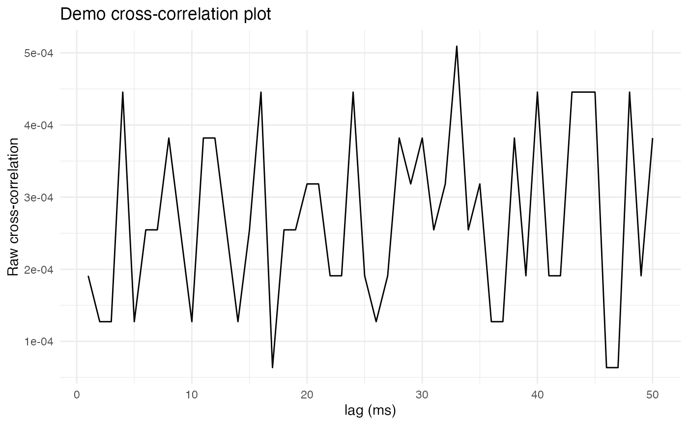
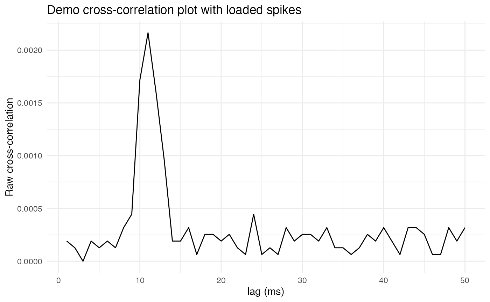
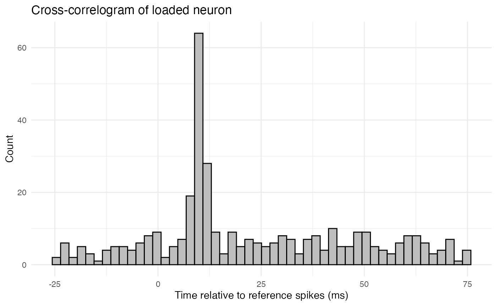
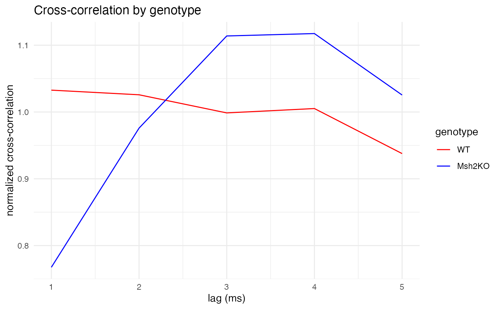

# Spike synchrony via cross-correlation

## Introduction

Synchronous firing between two neurons can be detected by computing the
cross-correlation of their spike trains. The *cross-correlation* between
two time series R (the reference series) and C (the comparison series)
is the correlation between R and a lagged copy of C. This tutorial shows
how to use functions from the neurons package and some basic R code to
compute and visualize cross-correlations between spike trains. Data from
the thalamic reticular nucleus (TRN) of wildtype and Mut-S Homolog 2
(Msh2) knock-out mice is used. As discussed in the
[preprint](https://www.biorxiv.org/content/10.1101/2025.02.13.638164v1)
from which the data is taken, the Msh2 knock-out mice were observed to
exhibit increased gap junction formation in the TRN, and thus it would
be expected that the knock-out mice would exhibit increased synchronous
firing. This is because gap junctions are fast, electrical synapses
between cells.

## Load spike rasters

The first step is to set up the R environment by clearing the workspace,
setting a random-number generator seed, and loading the neurons package.

``` r
# Clear the R workspace to start fresh
rm(list = ls())

# Set seed for reproducibility
set.seed(12345) 

# Load neurons package
library(neuronsDG, quietly = TRUE) 
```

The next step is to load data representing the spike trains to be
analyzed. In this case, the data is in a csv file and formatted as a
compact (spike-indexed) raster. That is, each row represents a spike,
with a column for the time of the spike and a column for the cell that
fired the spike. Additional columns provide information about the
recording session and covariates, such as genotype.

``` r
spike.rasters <- read.csv(
  system.file(
      "extdata", 
      "cross_corr_demo_data.csv", 
      package = "neurons"
    )
  )
print(head(spike.rasters))
```

``` scroll-output
##   time_in_ms genotype recording_name cell cluster
## 1     79.035       WT  penetration_1    1       1
## 2    211.563       WT  penetration_1    1       1
## 3    254.331       WT  penetration_1    1       1
## 4    267.630       WT  penetration_1    1       1
## 5    360.195       WT  penetration_1    1       1
## 6    371.877       WT  penetration_1    1       1
```

## Parsing trials

The data used here is from multi-channel probe recordings in mouse TRN.
These recordings were parsed into spike clusters (proxies for individual
cells) by kilosort1. In this data, the cluster column numbers the
clusters identified on each probe, while the cell column simply
renumbers the clusters so that each cluster has a unique identity.

In this case, the spike times are in milliseconds and run continuously
from zero to the end of the recording session. The recordings are long,
running tens of minutes, with many thousands of spikes. Hence, it may
not be the best idea to compute cross-correlations over the entire
recording session. Instead, the recordings should be parsed into shorter
trials. The trails could be defined by arbitrarily chunking the
recordings into segments of a fixed duration, but there is a better way,
given the goal of detecting synchronous firing.

Suppose R and C are binary series (of 0s and 1s) representing the
presence or absence of spikes in small time bins. Series R will be the
reference series, and series C will be the comparison series a lagged
copy of which is used for computing correlation. If we want to know
whether spikes in C tend to occur synchronous with, or shortly after
spikes in R, then it makes sense to define trials by the spikes in R.
Specifically, each spike in R will define a trial that begins some fixed
duration before the spike and ends some fixed duration after the spike.
A trial will be thrown out if a second spike from R occurs in it. Each
trial will thus contain a single spike from R at time zero. High
correlation at zero lag will indicate that C tends to fire synchronously
with R, while high correlation at a short positive lag will indicate
that C tends to fire shortly after R.

``` r
# Write function to parse a compact raster into trials defined by spikes from a reference cell
make_trials_from_spikes <- function(
    raster,
    cell_num,        # ID of reference cell
    prespike_time,   # In units of the raster, in this case, ms
    postspike_time,  # In units of the raster, in this case, ms
    clean_only = TRUE
  ) {
    
    # Identify the penetration of the cell of interest
    cell_pen <- unique(raster$recording_name[raster$cell == cell_num])
    
    # Subset raster to the penetration of the cell of interest
    raster_p <- raster[raster$recording_name == cell_pen,]
    
    # Get indices of spikes from the reference cell
    cell_idx <- which(raster_p$cell == cell_num)
    
    # Get spike times of the reference cell
    ref_cell_spikes <- raster_p$time_in_ms[cell_idx]
    
    # Find clear spikes, i.e., spikes surrounded by quiet periods
    ref_cell_spikes_prespike_quiet <- diff(c(0, ref_cell_spikes))
    spikes_preclear <- ref_cell_spikes_prespike_quiet >= prespike_time
    ref_cell_spikes_postspike_quiet <- diff(c(ref_cell_spikes, Inf))
    spikes_postclear <- ref_cell_spikes_postspike_quiet >= postspike_time
    clear_spikes_idx <- cell_idx[spikes_preclear & spikes_postclear]
    
    # Create trial column 
    raster_p$trial <- 0
    
    # Build trial around each clear spike from target cell 
    for (i in seq_along(clear_spikes_idx)) {
      spike_time <- raster_p$time_in_ms[clear_spikes_idx[i]]
      trial_start <- spike_time - prespike_time
      trial_end <- spike_time + postspike_time
      trial_mask <- raster_p$time_in_ms >= trial_start & raster_p$time_in_ms < trial_end
      raster_p$trial[trial_mask] <- i
      raster_p$time_in_ms[trial_mask] <- raster_p$time_in_ms[trial_mask] - spike_time
    }
    
    # Keep only spikes in trials
    raster_p <- raster_p[raster_p$trial > 0, ]
    
    # Return parsed raster
    return(raster_p)
    
  }
```

## Visualizing cross-correlation

As a demonstration, let’s parse trials for one cell.

``` r
# Parameters for trial parsing and cross-correlation
trial_duration <- 100 # ms
lag_divider <- 2      # max lag will be trial_duration/lag_divider
bs <- 1.0             # bin size in ms
pre_ratio <- 0.25     # fraction of trial duration before spike

# Choose two cells to compare
ref_cell <- 13
comp_cell <- 15

# Parse trials for the reference cell
raster_demo <- make_trials_from_spikes(
  raster = spike.rasters,
  cell_num = ref_cell, 
  prespike_time = trial_duration*pre_ratio,
  postspike_time = trial_duration*(1 - pre_ratio)
)
print(head(raster_demo))
```

``` scroll-output
##        time_in_ms genotype recording_name cell cluster trial
## 259359          0   Msh2KO  penetration_4   13       1     1
## 260113          0   Msh2KO  penetration_4   13       1     2
## 260600          0   Msh2KO  penetration_4   13       1     3
## 260814          0   Msh2KO  penetration_4   13       1     4
## 261090          0   Msh2KO  penetration_4   13       1     5
## 261150          0   Msh2KO  penetration_4   13       1     6
```

The neurons package includes functions for computing both [raw and
Pearson
cross-correlations](https://michaelbarkasi.github.io/neurons/articles/tutorial_tau_est_DG.md)
from a raster like **raster_demo**. The first step is to convert
**raster_demo** into a list of neuron objects using the
[load.rasters.as.neurons()](https://michaelbarkasi.github.io/neurons/reference/load.rasters.as.neurons.md)
function.

``` r
neurons <- load.rasters.as.neurons(
    raster_demo, 
    bin_size = bs, 
    min_duration = trial_duration,
    max_displacement = -trial_duration*pre_ratio
  )
```

The next step is to compute the cross-correlation between the reference
cell and the comparison cell. The **compute_crosscorrelation_R()**
method of a neuron object computes the cross-correlation (raw or
Pearson) between that neuron and another neuron. The method returns a
vector of cross-correlation values at lags from zero to the specified
max lag.

``` r
# Grab neurons from list
ref_neuron <- neurons[[paste0("neuron_", ref_cell)]]
comp_neuron <- neurons[[paste0("neuron_", comp_cell)]]

# Compute raw cross-correlation
cross_corr <- ref_neuron$compute_crosscorrelation_R(
    comp_neuron,                # Comparison neuron
    "sum",                      # Binning action ("sum", "mean", "boolean")
    trial_duration/lag_divider, # max lag
    TRUE,                       # Use raw correlation? If FALSE, use Pearson correlation
    TRUE                        # Verbose?
  )
```

``` scroll-output
## Computing cross-correlation between neuron 13 (ref) and neuron 15 (comparison)
## Both neurons have unit_time = ms
## Both neurons have t_per_bin = 1 ms
## Reference neuron trial length: 100 ms
## Comparison neuron trial length: 100 ms
## Converting to bins for cross-correlation calculation
## max_lag in bins: 50
## Reference neuron trial length in bins: 100
## Comparison neuron trial length in bins: 100
## Using bin_count_action = sum
## Computing cross-correlation vector of length 50 bins
## Possible lag steps: 50, good lag steps: 50
## Cross-correlation calculation complete
```

``` r
# Plot cross-correlation with ggplot2
ggplot2::ggplot(
  data.frame(
    lag = seq_along(cross_corr),
    value = cross_corr), 
  ggplot2::aes(x = lag, y = value)) +
  ggplot2::geom_line() +
  ggplot2::labs(
    x = "lag (ms)",
    y = "Raw cross-correlation",
    title = "Demo cross-correlation plot") +
  ggplot2::theme_minimal() +
  ggplot2::theme(
    panel.background = ggplot2::element_rect(fill = "white", colour = NA),
    plot.background  = ggplot2::element_rect(fill = "white", colour = NA))
```



Unfortunately, these two neurons seem to have no obvious peak in their
cross-correlation, suggesting that they do not fire synchronously. To
get a sense of what the cross-correlation plot would look like for two
synchronously firing neurons, let’s artificially load the comparison
neuron with lagged copies of spikes from the reference neuron.

``` r
# Make function to load lagged spikes
load_lagged_spikes <- function(
    raster,        # Raster to load
    cell_num_comp, # Number of cell to load
    delay_time     # Delay time in ms
  ) {
    # Find spikes from reference cell
    cell_idx_comp <- which(raster$cell == cell_num_comp)
    # Select subset of these spikes to replace
    cell_idx_comp <- sample(cell_idx_comp, length(cell_idx_comp)/4, replace = FALSE)
    # Replace with lagged copies of reference spikes
    raster$time_in_ms[cell_idx_comp] <- delay_time + rnorm(length(cell_idx_comp), 0, 1)
    return(raster)
  }

# Load lagged spikes into comparison cell
raster_demo_loaded <- load_lagged_spikes(raster_demo, comp_cell, 10)

# Remake neurons
neurons_loaded <- load.rasters.as.neurons(
    raster_demo_loaded, 
    bin_size = bs, 
    min_duration = trial_duration,
    max_displacement = -trial_duration*pre_ratio
  )

# Compute cross-correlation for loaded neurons
ref_neuron_loaded <- neurons_loaded[[paste0("neuron_", ref_cell)]]
comp_neuron_loaded <- neurons_loaded[[paste0("neuron_", comp_cell)]]
cross_corr_loaded <- ref_neuron_loaded$compute_crosscorrelation_R(
    comp_neuron_loaded, 
    "sum", 
    trial_duration/lag_divider,
    TRUE,
    TRUE
  )
```

``` scroll-output
## Computing cross-correlation between neuron 13 (ref) and neuron 15 (comparison)
## Both neurons have unit_time = ms
## Both neurons have t_per_bin = 1 ms
## Reference neuron trial length: 100 ms
## Comparison neuron trial length: 100 ms
## Converting to bins for cross-correlation calculation
## max_lag in bins: 50
## Reference neuron trial length in bins: 100
## Comparison neuron trial length in bins: 100
## Using bin_count_action = sum
## Computing cross-correlation vector of length 50 bins
## Possible lag steps: 50, good lag steps: 50
## Cross-correlation calculation complete
```

``` r
# Plot cross-correlation for loaded neurons
ggplot2::ggplot(
  data.frame(
    lag = seq_along(cross_corr_loaded),
    value = cross_corr_loaded), 
  ggplot2::aes(x = lag, y = value)) +
  ggplot2::geom_line() +
  ggplot2::labs(
    x = "lag (ms)",
    y = "Raw cross-correlation",
    title = "Demo cross-correlation plot with loaded spikes") +
  ggplot2::theme_minimal() +
  ggplot2::theme(
    panel.background = ggplot2::element_rect(fill = "white", colour = NA),
    plot.background  = ggplot2::element_rect(fill = "white", colour = NA))
```



Notice that now there is a clear peak, or spike, in correlation at a lag
of 10ms, which is the lag time used when loading spikes. This reflects
how the lagged and loaded copy of the comparison neuron’s spike train
contains a large number of spikes 10ms after spikes from the reference
neuron.

In addition to visualizing cross correlation as a line plot of
correlation as a function of lag, it can also be visualized as a
cross-correlogram, which is a histogram of the times of spikes from the
comparison neuron relative to spikes from the reference neuron. Here,
for example, is the cross-correlogram for the loaded neuron.

``` r
# Fetch the raster of the loaded comparison neuron
loaded_raster <- comp_neuron_loaded$fetch_spike_raster_R()
# Extract spike times relative to reference spikes
loaded_spikes <- loaded_raster[,1]
# Plot histogram of spike times
ggplot2::ggplot(
    data.frame(loaded_spikes = loaded_spikes),
    ggplot2::aes(x = loaded_spikes)
  ) +
  ggplot2::geom_histogram(bins = 50, color = "black", fill = "grey") +
  ggplot2::labs(
    title = "Cross-correlogram of loaded neuron",
    x = "Time relative to reference spikes (ms)",
    y = "Count"
  ) +
  ggplot2::theme_minimal() +
  ggplot2::theme(
    panel.background = ggplot2::element_rect(fill = "white", colour = NA),
    plot.background  = ggplot2::element_rect(fill = "white", colour = NA))
```



The above histogram shows a clear peak at 10ms, reflecting the lagged
spikes that were loaded into the comparison neuron.

## Analyzing covariates

The cells in the above demo data come from two genotypes of mice,
wildtype (WT) and Msh2 knock-outs (Msh2KO). Let’s compute
cross-correlations for all pairs of cells in the data and see if there
is any difference in cross-correlation between the two genotypes. Note
that this function only plots correlation as a function of lag (not the
cross-correlogram) and normalizes the values. This is because different
cells will have different firing rates, which will distort both the raw
cross-correlation and the cross-correlogram. Normalizing the
cross-correlation by its mean value helps to mitigate this distortion.

``` r
cross_corr_by_genotype <- function(
    raster,
    trial_duration, # in ms
    pre_ratio,      # fraction of trial duration before spike
    bs,             # bin size in ms
    lag_divider     # max lag will be trial_duration/lag_divider
  ) {
    
    # Extract cells from raster 
    cell_list <- unique(raster$cell) 
    
    # Compute cross-correlation by cell
    cross_corr_by_cell <- list()
    for (ref_cell in cell_list) {
      
      # Parse trials for the reference cell
      raster_ref_cell <- make_trials_from_spikes(
        raster = raster,
        cell_num = ref_cell, 
        prespike_time = trial_duration*pre_ratio,
        postspike_time = trial_duration*(1 - pre_ratio)
      )
      #cat("\n\nNumber of trials found: ", length(unique(raster_ref_cell$trial)))
      #stop("quality control")
      # ^^^ Interesting number to track for QC; 
      #      as trial duration increases, this number falls, making estimates less reliable
      
      # Load parsed raster into neurons
      neurons <- load.rasters.as.neurons(
        raster_ref_cell, 
        bin_size = bs, 
        min_duration = trial_duration,
        max_displacement = -trial_duration*pre_ratio
      )
      
      # Identify cells from same penetration as reference cell
      comp_cell_list <- unique(raster_ref_cell$cell)
      
      # Compute cross-correlation between reference cell and comparison cells
      cross_corr <- c()
      for (comp_cell in comp_cell_list) {
        
        # Don't compute autocorrelation
        if (ref_cell == comp_cell) next
        
        # Compute cross-correlation
        ref_neuron <- neurons[[paste0("neuron_", ref_cell)]]
        comp_neuron <- neurons[[paste0("neuron_", comp_cell)]]
        cross_corr_cc <- ref_neuron$compute_crosscorrelation_R(
          comp_neuron, 
          "sum", 
          trial_duration/lag_divider,   # max lag
          TRUE,                         # use raw?
          FALSE                         # verbose?
        )
        
        # Append to results
        cross_corr <- rbind(cross_corr, cross_corr_cc)
        
      }
      
      # Store cross-correlation results for this reference cell
      cross_corr_by_cell[[paste0("cross_corr_", ref_cell)]] <- cross_corr
      
    }
    
    # Separate cross-correlations by genotype
    geno_WT_crosscorr <- c()
    geno_Msh2KO_crosscorr <- c()
    for (ref_cell in seq_along(cross_corr_by_cell)) {
      
      # Get all cross-correlations for this reference cell
      cross_corr_matrix <- cross_corr_by_cell[[ref_cell]]
      
      # Get genotype of this reference cell
      geno <- unique(spike.rasters$genotype[spike.rasters$cell == ref_cell])
      
      # Process cross-correlation from each comparison cell
      for (comp_cell in 1:nrow(cross_corr_matrix)) {
        
        # Grab cross-correlation vector
        cross_corr_vector <- cross_corr_matrix[comp_cell, ]
        
        # Normalize
        cross_corr_vector <- cross_corr_vector/mean(cross_corr_vector)
        
        # Append to genotype-specific results
        if (geno == "WT") {
          geno_WT_crosscorr <- rbind(geno_WT_crosscorr, cross_corr_vector)
        } else if (geno == "Msh2KO") {
          geno_Msh2KO_crosscorr <- rbind(geno_Msh2KO_crosscorr, cross_corr_vector)
        }
        
      }
    }
    
    # Plot genotype-specific cross-correlations
    df <- data.frame(
      lag   = seq_along(colMeans(geno_WT_crosscorr)),
      geno1 = colMeans(geno_WT_crosscorr),
      geno2 = colMeans(geno_Msh2KO_crosscorr)
    )
    df_long <- data.frame(
      lag      = c(df$lag, df$lag),
      value    = c(df$geno1, df$geno2),
      genotype = factor(
        rep(c("WT", "Msh2KO"), each = nrow(df)),
        levels = c("WT", "Msh2KO")
      )
    )
    
    plt <- ggplot2::ggplot(df_long, ggplot2::aes(x = lag, y = value, color = genotype)) +
      ggplot2::geom_line() +
      ggplot2::scale_color_manual(
        values = c("WT" = "red", "Msh2KO" = "blue")
      ) +
      ggplot2::labs(
        x = "lag (ms)",
        y = "normalized cross-correlation",
        title = "Cross-correlation by genotype"
      ) +
      ggplot2::theme_minimal() +
      ggplot2::theme(
        panel.background = ggplot2::element_rect(fill = "white", colour = NA),
        plot.background  = ggplot2::element_rect(fill = "white", colour = NA)
      )
    print(plt)
    
    # ggplot2::ggsave(
    #   filename = paste0("cross_corr_plot_", trial_duration, "ms.svg"),
    #   plot = plt,
    #   device = svglite::svglite,
    #   width = 10, height = 7
    # )
    
  }
```

First, let’s compare the genotypes on a short timescale of 1-5ms.

``` r
cross_corr_by_genotype(
      raster = spike.rasters,
      trial_duration = 20,  # in ms
      pre_ratio = 0.5,      # fraction of trial duration before spike
      bs = 1,               # bin size in ms
      lag_divider = 4       # max lag will be trial_duration/lag_divider
  )
```



Next, let’s compare the genotypes on a medium timescale of 1-30ms.

``` r
cross_corr_by_genotype(
      raster = spike.rasters,
      trial_duration = 90,  # in ms
      pre_ratio = 1/3,      # fraction of trial duration before spike
      bs = 1,               # bin size in ms
      lag_divider = 3       # max lag will be trial_duration/lag_divider
  )
```


Finally, let’s compare the genotypes on a long timescale of 1-100ms.

``` r
cross_corr_by_genotype(
      raster = spike.rasters,
      trial_duration = 200, # in ms
      pre_ratio = 0.25,     # fraction of trial duration before spike
      bs = 1,               # bin size in ms
      lag_divider = 2       # max lag will be trial_duration/lag_divider
  )
```


As expected, for all three time scales, the plots make clear that
wildtype mice (red) exhibit constant cross-correlation hovering around
its mean, while the Msh2 knock-out mice (blue) exhibit pronounced peaks
in cross-correlation at 3-4ms of lag, showing synchronized firing. The
large peaks around 80ms are also curious, and perhaps unexpected. They
might also be due to random chance, as longer time scales leave fewer
quiet spikes from which to build trials (although the 200ms trial
duration still left well over 2,000 trials from which to sample,
compared with around 7,000 trials for the 20ms duration).
