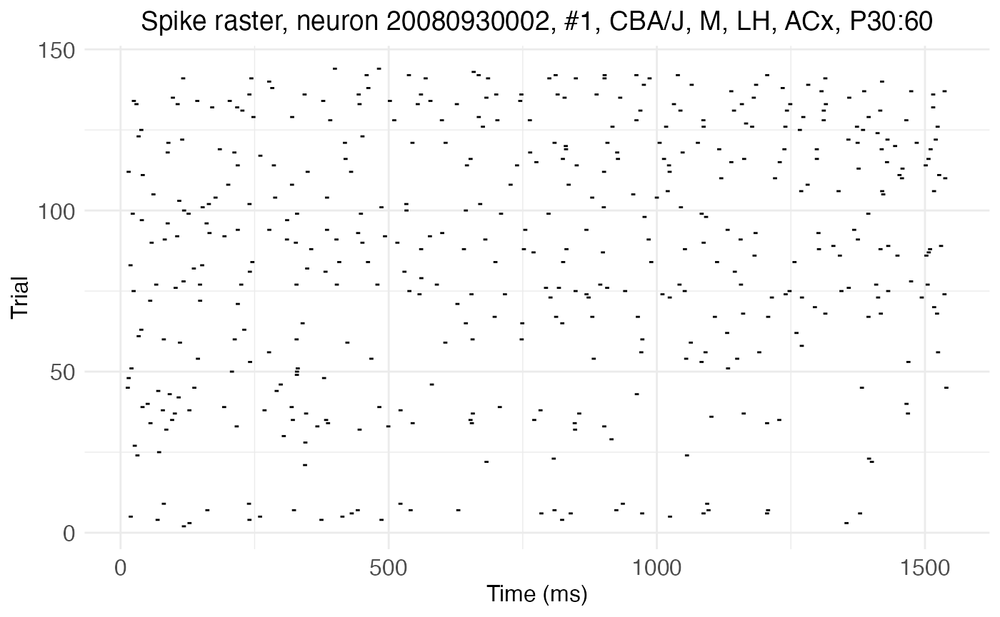
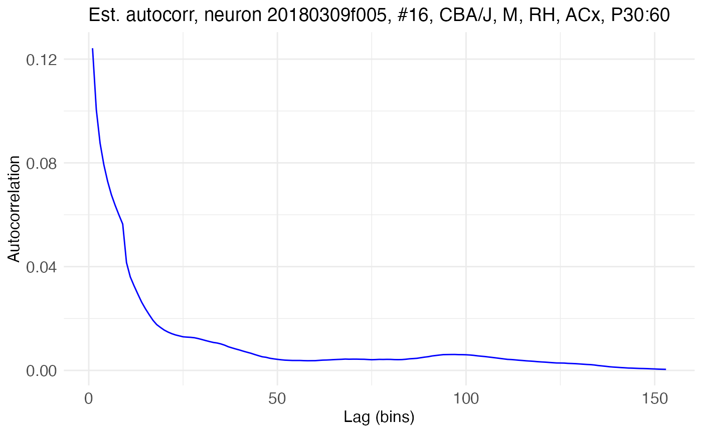
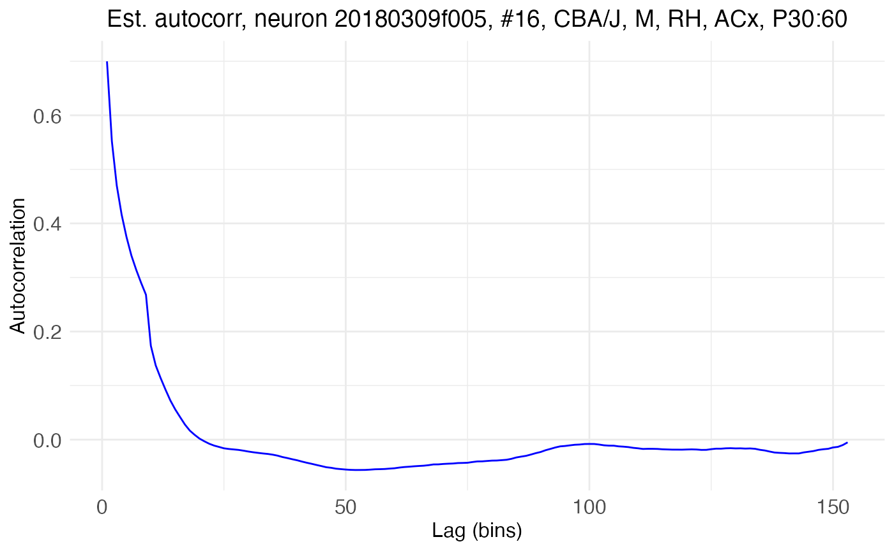
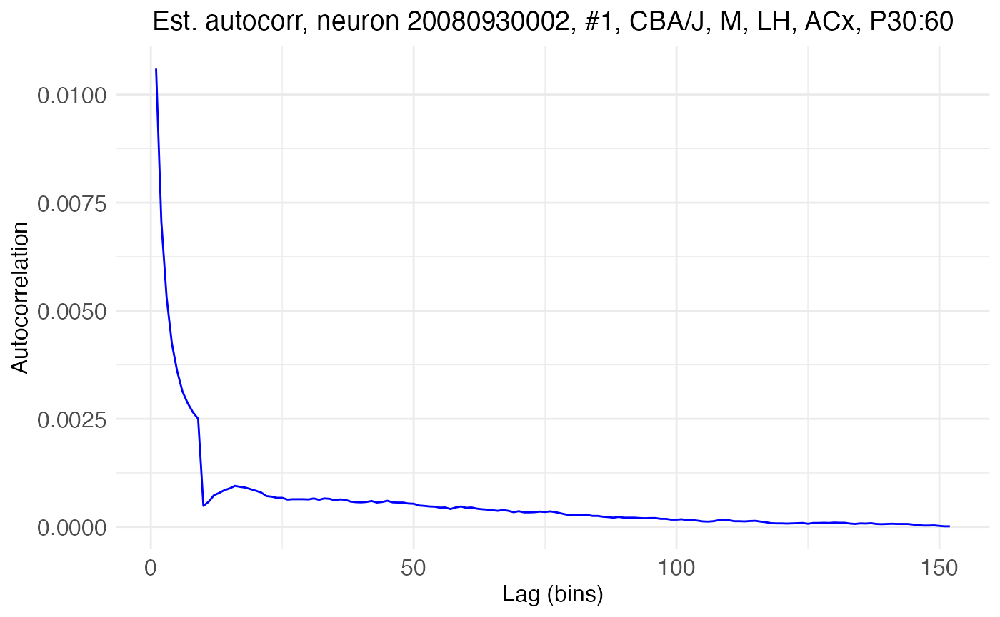
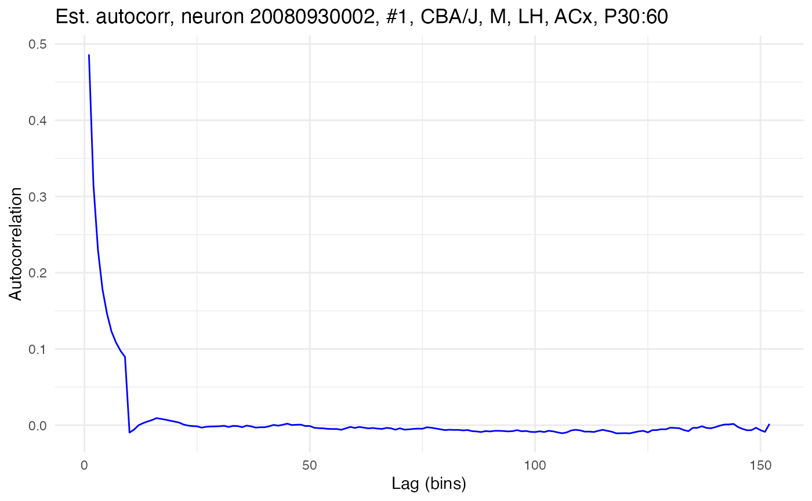

# Network time constants via dichotomized Gaussians

## Introduction

The extent to which an individual neuron feeds back on itself in a
recurrent loop can be estimated by its autocorrelation, i.e., the
correlation between the neuron’s membrane potential v at time t_1 and at
a later time t_2\>t_1. The more a spike *now* increases the probability
of a spike *later*, the stronger the neuron’s connection back onto
itself. A neuron’s autocorrelation, represented by the variable R, can
be modeled with an exponential decay function R = A\exp(-l/\tau) + b
where A is the *amplitude* (autocorrelation at the initial lag), l is
lag, \tau is the *network time constant*, and b is a constant (bias or
baseline) term. The time constant \tau is a measure of how quickly the
neuron’s autocorrelation decays back to baseline after a spike.

Network time constants are difficult to estimate from experimental data.
The spiking activity of a neuron is indicative of its recurrence only if
that neuron is receiving no other input. Thus, time constants must be
estimated from periods of spontaneous activity. These periods are short
and noisy, making time constant estimates from empirical calculations of
a neuron’s autocorrelation unreliable. A way to improve the
signal-to-noise ratio is needed, such as simulating many recordings.
However, typical approaches to such simulations, such as bootstrapping,
will only amplify the noise. A better approach is to use dichotomized
Gaussians.

This tutorial shows how to use the neurons package to estimate network
time constants using dichotomized Gaussians. Patch-clamp recordings will
be used as an example dataset. The recordings are from layer 2/3 of the
auditory cortex of mature wildtype mice, in both the left and right
hemisphere. These recordings are used by [Neophytou et
al. 2022](https://doi.org/10.1371/journal.pbio.3001803), who adapt and
apply the dichotomized Gaussian approach of [Macke et
al. 2009](https://doi.org/10.1162/neco.2008.02-08-713) to show that the
right auditory cortex of mice has more recurrence than the left. This
tutorial reproduces that analysis, with a few improvements.

## Load spike rasters

Set up the R environment by clearing the workspace, setting a
random-number generator seed, and loading the neurons package.

``` r
# Clear the R workspace to start fresh
rm(list = ls())

# Set seed for reproducibility
set.seed(12345) 

# Load neurons package
library(neurons) 
```

    ## Loading required package: ggplot2

    ## Loading required package: grid

    ## Loading required package: gridExtra

    ## Loading required package: colorspace

All of the data is contained in a single csv file, provided with the
neurons package, as a compact spike raster.

``` r
spike.rasters <- read.csv(
  system.file(
      "extdata", 
      "spike_rasters_2022data.csv", 
      package = "neurons"
    )
  )
print(head(spike.rasters))
```

``` scroll-output
##   trial sample cell time_in_ms recording_name hemi genotype sex    age region
## 1     2   1181    1      118.1    20080930002   LH    CBA/J   M P30:60    ACx
## 2     3   1286    1      128.6    20080930002   LH    CBA/J   M P30:60    ACx
## 3     3  13537    1     1353.7    20080930002   LH    CBA/J   M P30:60    ACx
## 4     4    691    1       69.1    20080930002   LH    CBA/J   M P30:60    ACx
## 5     4   2404    1      240.4    20080930002   LH    CBA/J   M P30:60    ACx
## 6     4   3746    1      374.6    20080930002   LH    CBA/J   M P30:60    ACx
```

The data takes the form of a dataframe the rows of which each represent
a single recorded spike. Each column gives relevant metadata, such as
the time in the recording of the spike, the identity of the neuron that
fired the spike, and the hemisphere in which that neuron was recorded.
The function
[load.rasters.as.neurons()](https://michaelbarkasi.github.io/neurons/reference/load.rasters.as.neurons.md)
will convert a compact raster of spikes like this one (a dataframe or
file name to a csv importable as such) into **neuron** objects (one per
cell), so long as it has the recognized columns: **cell**,
**time_in_ms**, and **trial**. If the optional columns
**recording_name**, **hemisphere**, **genotype**, **sex**, **region**,
or **age** are included, they will be recognized and added as metadata
to the neuron objects.

``` r
neurons <- load.rasters.as.neurons(spike.rasters, bin_size = 10.0)
cat("Number of cells discovered:", length(neurons))
```

``` scroll-output
## Number of cells discovered: 41
```

The **neuron** object class is native to C++ and integrated into neurons
(an R package) via Rcpp. It comes with built-in methods for many tasks,
such as estimating autocorrelation parameters with dichotomized Gaussian
simulations. Some of these methods can be accessed through R, but
neurons provides R-native wrappers for the most useful ones. The neurons
package also provides native R functions for plotting. Let’s plot the
rasters for two cells. The first has high autocorrelation, as can be
seen from the long horizontal streaks of spikes:

``` r
cell_high <- 16
plot.raster(neurons[[cell_high]]) 
```


The second has low autocorrelation, as can be seen from the more random
distribution of spikes without long streaks:

``` r
cell_low <- 1
plot.raster(neurons[[cell_low]]) 
```



## Computing empirical autocorrelation from data

There are two common definitions for the correlation R\_{XY} between two
random variables X and Y. Let \text{E}\[X\], \text{E}\[Y\], and
\text{E}\[XY\] be the expected values of X, Y, and their product XY. The
first definition, the *raw correlation*, is: R\_{XY} = \text{E}\[XY\]
The second, the *Pearson correlation*, centers and normalizes the raw
correlation: R\_{XY} = \frac{\text{E}\[XY\] -
\text{E}\[X\]\text{E}\[Y\]}{\sqrt{\text{E}\[X^2\] -
\text{E}\[X\]^2}\sqrt{\text{E}\[Y^2\] - \text{E}\[Y\]^2}} While only the
Pearson correlation will return values constrained to the range
\[-1,1\], the raw correlation is well-defined for a broader range of
cases, including cases where empirical estimates need to be made from
observations with little to no variance, such as spike rasters with low
firing rates.

The above equations are for theoretical *population* values, given in
terms of the expected value operator. Both definitions have empirical
analogues which can be used to calculate a value directly from a finite
sample. If \vec{X}=\langle X_1,\ldots,X_T\rangle and \vec{Y}=\langle
Y_1,\ldots,Y_T\rangle are each a series of observations collected from X
and Y, then the empirical raw correlation is given in terms of the dot
product: R\_{XY} = \frac{\vec{X}\cdot\vec{Y}}{T} =
\frac{1}{T}\sum\_{i=1}^T X_i Y_i If \mu\_{\vec{XY}} is the empirical
mean of the vector \vec{XY} of products X_iY_i, the raw correlation can
also be computed as R\_{XY} = \mu\_{\vec{XY}}. The empirical Pearson
correlation between \vec{X} and \vec{Y} with means \mu\_{\vec{X}} and
\mu\_{\vec{Y}} and standard deviations \sigma\_{\vec{X}} and
\sigma\_{\vec{Y}} is given by: R\_{XY} = \frac{\mu\_{\vec{XY}} -
\mu\_{\vec{X}}\mu\_{\vec{Y}}}{\sigma\_{\vec{X}} \sigma\_{\vec{Y}}} For
ease of reading, the vector notation will hereafter be dropped and
capital letters will be used to refer to both the random variables and
their empirical samples, with the understanding that the context will
make clear which is meant.

### Time series and repeated observations

If X is a time series X=\langle{}X_1, \ldots, X_t, \ldots, X_T\rangle{},
then its autocorrelation at lag l, denoted R\_{XX}(l), is the
correlation R\_{XY} between X and a copy Y=\langle{}X\_{l+1}, X\_{l+2},
X\_{l+3}, \ldots \rangle{} of X time shifted by some lag l. This lagged
copy will be shorter than X by l samples, so computing the empirical
autocorrelation requires adjusting the summation index and the
normalization term accordingly. For example, the empirical raw
autocorrelation at lag l is given by: R\_{XX}(l) =
\frac{1}{T-l}\sum\_{i=1}^{T-l} X_i Y\_{i+l} If X and Y are matrices
containing many trials (columns) of sample series (rows) of data
collected from the random variables X and Y, then the empirical
correlation between X and Y can be refined by averaging together the
correlations computed for each trial. For example, the empirical raw
autocorrelation at lag l is given by: R\_{XX}(l) =
\frac{1}{N}\sum\_{j=1}^N \frac{1}{T-l}\sum\_{i=1}^{T-l} X\_{ij}
Y\_{(i+l)j} where N is the number of trials (columns) in X and Y.

### Time binning

The **neuron** object class has built-in methods for computing both the
raw and Pearson empirical autocorrelation from a spike raster S, which
is (of course) just a matrix for a random variable (spike or no-spike)
sampled over time (rows) and trials (columns). The variable S is
discrete, with only two possible values: 1 for a spike, 0 for no spike.
This binary nature means that S does not play nicely with any of the
empirical formulas given above. If given the raw binary input, these
formulas will return zero or near zero autocorrelation.

For more cogent results, the rows (i.e., the time axis) of the matrix S
must be downsampled via binning. This binning is done automatically by
the function
[load.rasters.as.neurons()](https://michaelbarkasi.github.io/neurons/reference/load.rasters.as.neurons.md)
and can be controlled via its argument **bin_size**, which below is
represented by \Delta. The default, used in the code above, is 10ms.

A further question to decide when computing empirical autocorrelation is
how to handle multiple spikes in a single bin. There are three options
supported by the neurons package: “sum”, “mean”, and “boolean”. The
option is set via the argument **bin_count_action**, available in the
functions
[compute.autocorr()](https://michaelbarkasi.github.io/neurons/reference/compute.autocorr.md),
[process.autocorr()](https://michaelbarkasi.github.io/neurons/reference/process.autocorr.md),
and
[estimate.autocorr.params()](https://michaelbarkasi.github.io/neurons/reference/estimate.autocorr.params.md).
In all cases, the default is “sum”, meaning that the value of S in a
given bin on a given trial is the total count of spikes falling in that
bin. The option “mean” will instead return the mean number of spikes in
the bin, while “boolean” will return 1 if there is at least one spike in
the bin and 0 otherwise. From *ad hoc* development and testing, the
“sum” function works best, presumably because it preserves the most
information about correlation.

Time binning introduces a dilemma. On the one hand, it’s essential for
avoiding autocorrelation values of zero. On the other hand, it violates
a key mathematical fact underlying the dichotomized Gaussian approach.
This is the fact, explained below, that:
\text{E}\[X\_{i_1}X\_{i_2}\]=\Phi_2^+(\gamma,K\_{V\_{i_1}V\_{i_2}})
Hence, the best approach seems to be a middle path. A large time bin,
such as 20ms, results in robust autocorrelation estimates from the spike
data, but leads to unreliable dichotomized Gaussian simulations. A small
time bin, such as 1ms, leads to unreliable empirical autocorrelation
estimates, but reliable dichotomized Gaussian simulations. The default
(10ms) falls in the middle. Whatever the chosen bin size, a rolling mean
is taken to smooth the empirical autocorrelation value.

### Example autocorrelation calculations

The function
[compute.autocorr()](https://michaelbarkasi.github.io/neurons/reference/compute.autocorr.md)
takes a single neuron and computes its empirical autocorrelation using
its spike raster. Here, for example, is the function used to compute the
raw autocorrelation for the neuron with high autocorrelation shown
above:

``` r
compute.autocorr(neurons[[cell_high]], use_raw = TRUE)
plot.autocorrelation(neurons[[cell_high]])
```



Which type of correlation, raw or Peason, is calculated is controlled by
the **use_raw** option. The Pearson autocorrelation for the same data
can be got by setting **use_raw** to FALSE:

``` r
compute.autocorr(neurons[[cell_high]], use_raw = FALSE)
plot.autocorrelation(neurons[[cell_high]])
```



As another example, here is the raw autocorrelation for the neuron with
low autocorrelation shown above:

``` r
compute.autocorr(neurons[[cell_low]], use_raw = TRUE)
plot.autocorrelation(neurons[[cell_low]])
```



And the Pearson autocorrelation for the same data:

``` r
compute.autocorr(neurons[[cell_low]], use_raw = FALSE)
plot.autocorrelation(neurons[[cell_low]])
```



## Modeling autocorrelation decay

Theoretically, autocorrelation can be expected to exhibit exponential
decay over increasing lag, at least in cases with nonzero
autocorrelation. As noted above, this decay can be modeled with the
function: R = A\exp(-l/\tau) + b where A is the *amplitude*
(autocorrelation at the initial lag), l is lag, \tau is the *network
time constant*, and b is a constant (bias or baseline) term. The neurons
package assumes that the bias term b is a constant function of the
firing rate \lambda and bin size \Delta, given as: b =
(\lambda{}\Delta)^2 In this formula both \lambda and \Delta must be in
the same unit of time, e.g., ms. The values for A and \tau are set by
minimizing the mean squared error between the empirical autocorrelation
and the model function, using the [L-BFGS algorithm as implemented in
NLopt](https://nlopt.readthedocs.io/en/latest/NLopt_Algorithms/#low-storage-bfgs).

Model fitting is accessed in the neurons package with the function
[fit.edf.autocorr()](https://michaelbarkasi.github.io/neurons/reference/fit.edf.autocorr.md).
The function takes a single neuron and fits the exponential decay
function to its empirical autocorrelation. Here, for example, is the
function used to fit the model to the raw autocorrelation for the neuron
with high autocorrelation:

``` r
compute.autocorr(neurons[[cell_high]]) # Recompute with raw autocorrelation
fit.edf.autocorr(neurons[[cell_high]])
plot.autocorrelation(neurons[[cell_high]])
```


The fitted model is plotted as the red line. The parameters of the
exponential decay fit can be fetched directly with a neuron method and
provide succinct quantification of the empirical autocorrelation.

``` r
print(neurons[[cell_high]]$fetch_EDF_parameters())
```

``` scroll-output
##           A         tau   bias_term 
##  0.12690314 69.37772012  0.01105918
```

In this case, the time constant tau is estimated to be 69.4ms and the
initial autocorrelation A is estimated to be 0.127.

The above shows empirical autocorrelation and model fit being performed
in separate steps and for only one neuron at a time. The function
[process.autocorr()](https://michaelbarkasi.github.io/neurons/reference/process.autocorr.md)
will perform both steps at once for an entire list of neurons and return
the results in a data frame.

``` r
autocor.results.batch <- process.autocorr(neurons)
print(head(autocor.results.batch))
```

``` scroll-output
##       cell    lambda_ms  lambda_bin           A      tau    bias_term   autocorr1 max_autocorr mean_autocorr min_autocorr
## 1 neuron_1 0.0021196442 0.021196442 0.012310361 37.43632 4.492891e-04 0.012759650  0.009873868  0.0007344238 4.492891e-04
## 2 neuron_2 0.0003823936 0.003823936 0.002574664 33.53497 1.462249e-05 0.002589286  0.001925424  0.0000671805 1.462249e-05
## 3 neuron_3 0.0036099494 0.036099494 0.021596412 64.56348 1.303173e-03 0.022899585  0.019800771  0.0022174598 1.303173e-03
## 4 neuron_4 0.0017867616 0.017867616 0.010522253 47.95608 3.192517e-04 0.010841505  0.008861022  0.0006411112 3.192517e-04
## 5 neuron_5 0.0096557914 0.096557914 0.075155978 31.09102 9.323431e-03 0.084479409  0.063808644  0.0107283990 9.323431e-03
## 6 neuron_6 0.0087146980 0.087146980 0.045516247 38.10554 7.594596e-03 0.053110843  0.042604825  0.0086703283 7.594596e-03
```

## Estimating network time constants

The above discussion concerns computing and modeling *empirical*
autocorrelation, i.e., autocorrelation as computed directly off a finite
sample. However, what’s usually desired is an estimate of the
*population* value, i.e., the true autocorrelation exhibited by a
population of cells defined by some shared covariate value. Estimating
this true value is done by taking an infinite sample, sampling not just
all existing population members, but also all possible members. This is,
of course, impossible. However, it can be approximated by taking larger
and larger samples. The ideal, of course, would be to take samples of
the actual population, e.g., recording more cells, or recording more
trials from the same cells. However, in practice this is not possible.
Instead, mathematical techniques are used to simulate larger samples
from existing data. The most well-known technique is bootstrapping,
i.e., “resampling” the observed data with replacement. Bootstrapping
does a good job perserving the underlying statistical distribution of
data when the signal-to-noise ratio is high, but when the
signal-to-noise ratio is low, bootstrapping will simply amplify the
noise. This is the case with autocorrelation estimated from spike
rasters, especially when the firing rate is low and the recording time
is short.

### Dichotomized Gaussians

Instead of resampling with replacement, an alternative approach is to
simulate new samples through a random-process model that’s constrained
to be consistent with the observed data. In the case of exponentially
decaying autocorrelation, dichotomized Gaussians provide an ideal model.
The basic idea is to model the noisy processes underlying neuron spiking
across time as a latent multivariate Gaussian process, with one Gaussian
distribution per time bin. On this model, autocorrelation is modeled as
correlation between these Gaussians.

Consider the following example of a dichotomized Gaussian. First, let’s
draw a random sample of 300 points from a bivariate Gaussian
distribution V, such that both component distributions V_1 and V_2 are
normal (i.e., have mean \mu of 0 and standard deviation \sigma of 1) and
such that a covariance K_V of 0.75 exists between these distributions.

``` r
V_sample <- MASS::mvrnorm(
    n = 300,
    mu = c(0,0),
    Sigma = matrix( 
        c(1, 0.75, 
          0.75, 1), 
        nrow = 2, 
        ncol = 2
      ) 
  )
```

Next, let’s plot these points and superimpose on top of them thresholds
\gamma = 1 for both dimensions, shading the area of points below the
threshold.

``` r
# Convert to data frame for plotting
V_sample <- as.data.frame(V_sample) 
threshold <- 1
# Make and print plot
ggplot2::ggplot(data = V_sample, ggplot2::aes(x = V_sample[,1], y = V_sample[,2])) +
  ggplot2::geom_point() +
  ggplot2::labs(
    x = "V1", 
    y = "V2", 
    title = "Example bivariate data") +
  ggplot2::ylim(c(-4.5,4.5)) +
  ggplot2::xlim(c(-4.5,4.5)) +
  ggplot2::theme_minimal() +
  ggplot2::theme(
    panel.background = ggplot2::element_rect(fill = "white", colour = NA),
    plot.background  = ggplot2::element_rect(fill = "white", colour = NA)) +
  ggplot2::geom_vline(xintercept = 0, color = "darkgray", linewidth = 1) +
  ggplot2::geom_hline(yintercept = 0, color = "darkgray", linewidth = 1) +
  ggplot2::geom_vline(xintercept = threshold, color = "darkblue", linewidth = 1) +
  ggplot2::geom_hline(yintercept = threshold, color = "darkblue", linewidth = 1) +
  ggplot2::annotate(
    "rect", 
    xmin = -Inf, xmax = threshold, 
    ymin = -Inf, ymax = threshold, 
    fill = "lightblue", alpha = 0.3) +
  ggplot2::annotate(
    "text", x = threshold + 0.35, y = 4.5, 
    label = "gamma", parse = TRUE, color = "darkblue", 
    size = 7, hjust = 0) +
  ggplot2::annotate(
    "text", x = 4.5, y = threshold + 0.35, 
    label = "gamma", parse = TRUE, color = "darkblue", 
    size = 7, vjust = 0)
```


Notice how a threshold value \gamma defines, for any V_i, a new binary
random variable X such that X=1 if V_i\>\gamma and X=0 otherwise. The
variable X is the “dichotomized Gaussian”.

### Simulating spike rate

If X is a dichotomized Gaussian, the probability P(X=1) that X is 1 is
given by the cumulative distribution function of V_i evaluated at
\gamma. As each V_i is stipulated to be a standard normal (\mu=0 and
\sigma=1), this cumulative distribution function is the standard normal
cumulative distribution function \Phi: \Phi(x) = \frac{1}{\sqrt{2\pi}}
\int\_{-\infty}^x \exp(-t^2/2) dt Thus: P(X=1) = P(V_i\>\gamma) = 1 -
\Phi(\gamma) In the above plot, the function \Phi(\gamma) corresponds to
the shaded area of each axis, while 1 - \Phi(\gamma)=P(X=1) corresponds
to the non-shaded area.

It follows that V_i can be used to simulate a neuron with mean spike
rate \lambda by setting the threshold \gamma such that: \lambda = 1 -
\Phi(\gamma) which means that: \gamma = \Phi^{-1}(1-\lambda) where
\Phi^{-1} is the inverse of \Phi, i.e., is the quantile function. This
quantile function can be computed via well-known numerical
approximations, meaning that a dichotomized Gaussian can easily be used
to simulate a neuron with a desired mean spike rate \lambda.

### Simulating autocorrelation

While simulating a given spike rate \lambda is straightforward,
simulating autocorrelation is not. How is autocorrelation to be
represented in the model? If the correlation between two component
dimensions V\_{i_1} and V\_{i_2} of a multivariate Gaussian is to
represent the autocorrelation between two time bins X\_{i_1} and
X\_{i_2} of a spike raster separated by lag l, then each V_i should not
be thought of as a separate neuron, but rather as the same neuron at
different time points.

While this is an insightful idea, the operation of thresholding, needed
to convert a Gaussian variable V_i into a simulated binary spike
variable X_i, will change the correlation: R\_{V\_{i_1}V\_{i_2}} \neq
R\_{X\_{i_1}X\_{i_2}} However, all is not lost. Given some
autocorrelation R\_{X\_{i_1}X\_{i_2}} between two time bins X\_{i_1} and
X\_{i_2} separated by lag l for a neuron X with spike rate \lambda, a
correlation R\_{V\_{i_1}V\_{i_2}} can often be found which, when these
variables V_i are thresholded by \gamma = \Phi^{-1}(1-\lambda), gives
back the original correlation R\_{X\_{i_1}X\_{i_2}}. Actually, in this
case, it’s the covariance K\_{V\_{i_1}V\_{i_2}} that is sought. Knowing
the correlation R\_{V\_{i_1}V\_{i_2}} is not critical, although because
V is normal, R\_{V\_{i_1}V\_{i_2}} = K\_{V\_{i_1}V\_{i_2}}.

By definition, the covariance K\_{X\_{i_1}X\_{i_2}} is given by:
K\_{X\_{i_1}X\_{i_2}}= \text{E}\[X\_{i_1}X\_{i_2}\] -
\text{E}\[X\_{i_1}\]\text{E}\[X\_{i_2}\] For all i, \text{E}\[X\_{i}\] =
P(V\_{i}\>\gamma)=1-\Phi(\gamma) Further, notice that the expected value
of the product X\_{i_1}X\_{i_2} is given by the upper-tail cumulative
distribution function of a bivariate normal distribution with covariance
K\_{V\_{i_1}V\_{i_2}}, evaluated at \gamma for both components:
\text{E}\[X\_{i_1}X\_{i_2}\] = \Phi_2^+(\gamma,K\_{V\_{i_1}V\_{i_2}})
For a threshold x, \Phi_2^+(x,K\_{V\_{i_1}V\_{i_2}}) is the probability
that both components of a bivariate normal distribution with covariance
K\_{V\_{i_1}V\_{i_2}} are greater than x: \begin{aligned}
&\Phi_2^+(x,K\_{V\_{i_1}V\_{i_2}}) \\ &\\\\\\= P(V_1\>x, V_2\>x \\\|\\
V_1, V_2\sim \text{MVN}(\mu=0,\sigma=1,K=K\_{V\_{i_1}V\_{i_2}})) \\
&\\\\\\= \frac{1}{\sqrt{(2\pi)^2\mathbf{det}(K\_{V\_{i_1}V\_{i_2}})}}
\int\_{x}^\infty \int\_{x}^\infty \exp(-\frac{1}{2}\langle
V\_{i_1}V\_{i_2}\rangle^\text{T}K\_{V\_{i_1}V\_{i_2}}^{-1}\langle
V\_{i_1}V\_{i_2}\rangle) \langle V\_{i_1}V\_{i_2}\rangle \end{aligned}

Putting it all together: K\_{X\_{i_1}X\_{i_2}} =
\Phi_2^+(\gamma,K\_{V\_{i_1}V\_{i_2}}) - (1-\Phi(\gamma))^2 Thus, the
covariance K\_{V\_{i_1}V\_{i_2}} between V\_{i_1} and V\_{i_2} which,
after dichotomization, yields covariance K\_{X\_{i_1}X\_{i_2}}, can be
found by solving for K\_{V\_{i_1}V\_{i_2}} in the equation:
0=K\_{X\_{i_1}X\_{i_2}} - \Phi_2^+(\gamma,K\_{V\_{i_1}V\_{i_2}}) +
(1-\Phi(\gamma))^2 The neurons package solves this equation for
K\_{V\_{i_1}V\_{i_2}} using a root bisection algorithm.

The only remaining task is to determine the covariance needed for a
given desired autocorrelation. This is straightforward from the
definitions of each type of correlation. For raw autocorrelation:
K\_{X\_{i_1}X\_{i_2}} = R\_{X\_{i_1}X\_{i_2}} - \lambda^2for \lambda in
time units of bin. For Pearson autocorrelation: K\_{X\_{i_1}X\_{i_2}} =
R\_{X\_{i_1}X\_{i_2}}\sigma_X^2where \sigma_X^2 is the variance of X,
again in bin units.

### Running and bootstrapping simulations

The function
[estimate.autocorr.params()](https://michaelbarkasi.github.io/neurons/reference/estimate.autocorr.params.md)
takes a list of neurons and:

1.  Computes the empirical autocorrelation of each neuron.
2.  Fits an exponential decay model to that empirical autocorrelation.
3.  Generates many simulated spike trains (dichotomized Gaussians) based
    on the values R\_{XX} predicted by the model of the empirical
    autocorrelation and the observed firing rate \lambda of the neuron.
4.  Computes the empirical autocorrelation of each simulated spike
    train.
5.  Fits an exponential decay model to the empirical autocorrelation of
    each simulated spike train.

This procedure yields a distribution of possible \tau values for each
neuron. For the purpose of speed, this tutorial runs only 100
simulations per neuron, but in practice, 1000 or more simulations should
be run.

``` r
autocor.ests <- estimate.autocorr.params(
    neuron_list = neurons,
    n_trials_per_sim = 500, 
    n_sims_per_neurons = 100,
    use_raw = TRUE
  )
print(head(autocor.ests$estimates))
```

``` scroll-output
##    lambda_ms lambda_bin          A      tau    bias_term  autocorr1 max_autocorr mean_autocorr min_autocorr
## 1 0.01480282  0.1480282 0.01135389 29.60453 0.0002191234 0.01157302  0.008318400  0.0004195115 0.0002191234
## 2 0.01777465  0.1777465 0.01307888 32.77918 0.0003159381 0.01339481  0.009955992  0.0005759667 0.0003159381
## 3 0.01730986  0.1730986 0.01259854 33.58607 0.0002996312 0.01289817  0.009653952  0.0005572653 0.0002996312
## 4 0.01904225  0.1904225 0.01415649 38.63070 0.0003626074 0.01451909  0.011290424  0.0007024252 0.0003626074
## 5 0.01616901  0.1616901 0.01183272 34.95299 0.0002614370 0.01209416  0.009150043  0.0005148006 0.0002614370
## 6 0.01540845  0.1540845 0.01177011 29.77690 0.0002374204 0.01200753  0.008650034  0.0004465796 0.0002374204
```

With the simulations run, the final step is to estimate the network time
constant for covariates of interest. The function
[analyze.autocorr()](https://michaelbarkasi.github.io/neurons/reference/analyze.autocorr.md)
does this by bootstrapping over the tau values obtained from the
simulations. If there are n neurons in a covariate level, m simulations
have been run per neuron, then each bootstrap resample consists of the
mean of n draws with replacement from the pool of nm values for \tau.
For this tutorial, 10k bootstrap resamples are used.

``` r
autocor.results.bootstraps <- analyze.autocorr(
    autocor.ests,
    covariate = c("hemi","genotype"),
    n_bs = 1e4
  )
```

The function
[analyze.autocorr()](https://michaelbarkasi.github.io/neurons/reference/analyze.autocorr.md)
returns a list with two objects. The first is **resamples**, a dataframe
holding the tau values for each covariate from each simulation.

``` r
print(head(autocor.results.bootstraps$resamples))
```

``` scroll-output
##   LH_CBA/J RH_CBA/J
## 1 56.73363 53.67913
## 2 50.86373 56.29508
## 3 47.13767 51.25537
## 4 53.21613 48.99225
## 5 53.31073 59.97263
## 6 52.45779 56.65133
```

The second is **distribution_plot**, a ggplot2 object visualizing the
bootstrap distributions of tau for each covariate.

``` r
print(autocor.results.bootstraps$distribution_plot)
```


## Code summary

The essential steps to run this analysis are as follows:

``` r
# Setup
rm(list = ls())
set.seed(12345) 
library(neurons) 

# Load demo data
spike.rasters <- read.csv(
  system.file(
      "extdata", 
      "spike_rasters_2022data.csv", 
      package = "neurons"
    )
  )

# Create neuron objects
neurons <- load.rasters.as.neurons(spike.rasters, bin_size = 10.0)

# Run dichotomized Gaussian simulations 
autocor.ests <- estimate.autocorr.params(
    neuron_list = neurons,
    n_trials_per_sim = 500, 
    n_sims_per_neurons = 100,
    use_raw = TRUE
  )

# Analyze results by covariate
autocor.results.bootstraps <- analyze.autocorr(
    autocor.ests,
    covariate = c("hemi","genotype"),
    n_bs = 1e4
  )
```
