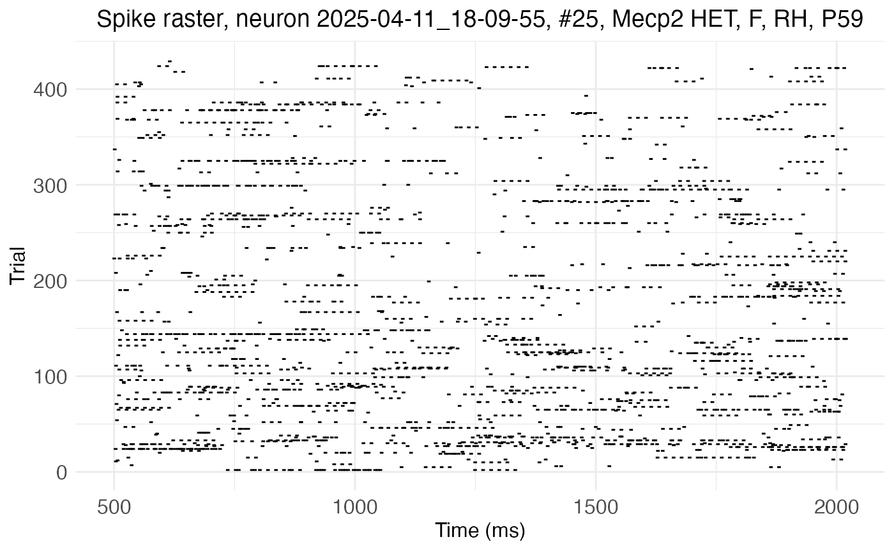
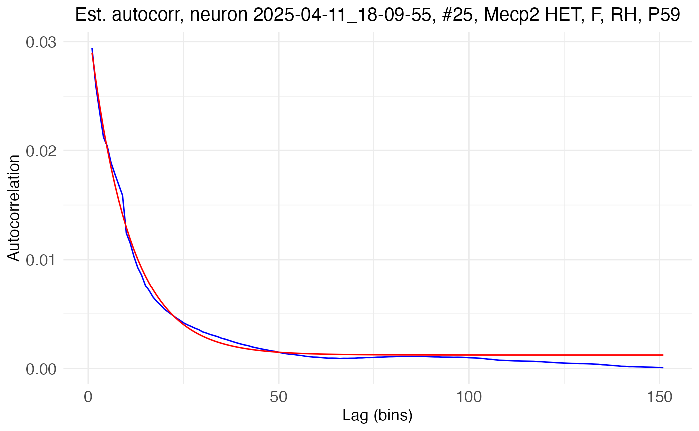
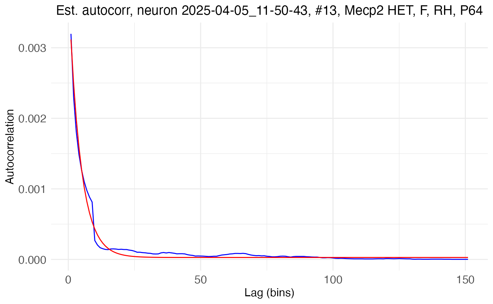
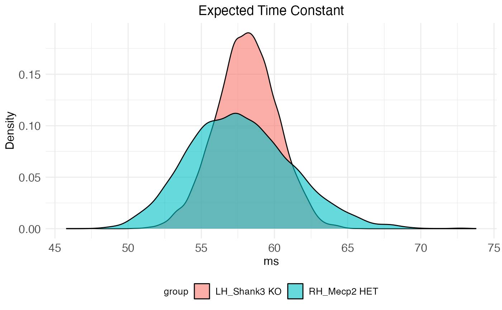

# Network time constants from KiloSort4 data

## Introduction

The neurons package provides functions to use [dichotomized Gaussians to
estimate network time
constants](https://michaelbarkasi.github.io/neurons/articles/tutorial_tau_est_DG.md)
on different kinds of spike data ([Macke et
al. 2009](https://doi.org/10.1162/neco.2008.02-08-713), [Neophytou et
al. 2022](https://doi.org/10.1371/journal.pbio.3001803)), including
kilosort4 output.
[KiloSort4](https://doi.org/10.1038/s41592-024-02232-7) is a [Python
package](https://github.com/MouseLand/Kilosort), completely distinct
from the neurons package, for extracting spike clusters (a proxy for
individual neurons) from multi-channel probe recordings. Network time
constants provide an estimate of recurrence by quantifying decay in
spiking autocorrelation as a function of lag time. A higher network time
constant indicates that a neuron receives a larger number of projections
back on itself. Intuitively, the longer into the future a spike *now*
increases the probability of a spike *later*, the stronger the
connections from that neuron back onto itself must be.

## Load data

Begin by clearing the R workspace, setting a random-number generator
seed, and loading the neurons package.

``` r
# Clear the R workspace to start fresh
rm(list = ls())

# Set seed for reproducibility
set.seed(12345) 

# Load neurons package
library(neuronsDG, quietly = TRUE) 
```

### Spike and stimulus data

Provide the file path to the output from kilosort4. Recordings from the
left and right hemisphere of various genotypes of mice are used for this
tutortial. These recordings targeted the auditory cortex and were made
while auditory stimuli were played at regular intervals.

``` r
# Set path to data 
demo_data <- system.file(
    "extdata", 
    "kilo4demo", 
    package = "neurons"
  )
```

The function used to process kilosort4 output is
[preprocess.kilo4()](https://michaelbarkasi.github.io/neurons/reference/preprocess.kilo4.md).
This function expects its argument **data_path** to point to a folder
the subfolders of which each contain a single kilosort4 output. This
output should be in its own folder **/kilosort4**. The following four
files are needed:

- **spike_positions.npy**: 2D array giving the x and y position of each
  spike  
- **spike_clusters.npy**: integer giving the cluster number of each
  spike  
- **spike_times.npy**: sample number at which the spike occurred
- **cluster_group.tsv** or **cluster_KSLabel.tsv** or
  **cluster_info.tsv**: 2D array giving status of each cluster (0=noise,
  1=MUA, 2=Good, 3=unsorted)

In addition, a MATLAB file **includeVector.mat** specifying whether each
cluster is stimulus-responisve (1) or not (0) should be included in the
kilosort4 folder. Finally, along with the kilosort4 subfolder, there
should be a file **StimulusStamps.csv** in each recording folder.


Folder structure necessary for
[preprocess.kilo4()](https://michaelbarkasi.github.io/neurons/reference/preprocess.kilo4.md)
function.

### Covariate data

Metadata about the recordings (formatted as a dataframe) is needed to
supply covariates.

``` r
# Load 
kilo4_metadata <- read.csv(
    system.file(
      "extdata", 
      "meta_data_kilo4demo.csv", 
      package = "neurons"
    )
  )

# Preview
print(head(kilo4_metadata))
```

``` scroll-output
##          DAY Neuralynx_ID   EXPER HEMISPHERE PROBE COORDINATES_SHANK_1 COORDINATES_SHANK_2    STRAIN AGE SEX  DEPTH
## 1 2025-02-06     13-06-34 001-001         RH  H10b                 0,0                 0,0       C57 P79   F 1156.0
## 2 2025-02-06     14-03-05 001-002         RH  H10b                 0,0                 0,0       C57 P79   F 1209.0
## 3 2025-02-06     15-36-59 001-004         RH  H10b                 0,0                 0,0       C57 P79   F 1003.0
## 4 2025-02-06     15-53-03 001-005         RH  H10b                 0,0                 0,0       C57 P79   F 1003.0
## 5 2025-02-20     16-19-12 001-001         RH  H10b                 0,0                 0,0 Mecp2 HET P79   F 1191.4
## 6 2025-02-20     17-04-02 001-002         RH  H10b                 0,0                 0,0 Mecp2 HET P79   F 1191.4
```

The neurons package (as of v1.0) can only handle certain covariates, and
expects them to have specific names (**type**, **genotype**, **sex**,
**hemi**, **region**, **age**). The package also expects the dataframe
holding those covariates to have rows labeled with recording names that
match the format of the recording names in the data.

``` r
# Format and apply recording names to metadata as row names
rownames(kilo4_metadata) <- paste0(
    kilo4_metadata$DAY, 
    "_",
    kilo4_metadata$Neuralynx_ID
  )

# Keep only the relevant columns (covariates of interest)
kilo4_metadata <- kilo4_metadata[,c("HEMISPHERE","STRAIN","AGE","SEX")]

# Rename columns to match what's expected by neurons package 
colnames(kilo4_metadata) <- c("hemi", "genotype", "age", "sex")

# Preview 
print(head(kilo4_metadata))
```

``` scroll-output
##                     hemi  genotype age sex
## 2025-02-06_13-06-34   RH       C57 P79   F
## 2025-02-06_14-03-05   RH       C57 P79   F
## 2025-02-06_15-36-59   RH       C57 P79   F
## 2025-02-06_15-53-03   RH       C57 P79   F
## 2025-02-20_16-19-12   RH Mecp2 HET P79   F
## 2025-02-20_17-04-02   RH Mecp2 HET P79   F
```

## Preprocessing kilosort4 data into spike rasters

The function
[preprocess.kilo4()](https://michaelbarkasi.github.io/neurons/reference/preprocess.kilo4.md)
converts cluster spike times into spike rasters of the format expected
by the neurons package.

### Parsing trials and quality control

The output of kilosort4 must be partitioned into trials, which
[preprocess.kilo4()](https://michaelbarkasi.github.io/neurons/reference/preprocess.kilo4.md)
does with start and stop times relative to a stimulus specified in
**StimulusStamps.csv**. For example, information about responses to
stimuli can be analyzed by setting the start time to something negative
(before the stimulus) and the end time to something positive (after the
stimulus). However, for estimating autocorrelation, it’s the spontaneous
activity during a period of silence after the stimulus which should be
analyzed. In this case, the start time should be some time after the
stimulus (to allow for settling) and the end time some time later.

``` r
spike.rasters <- preprocess.kilo4(
    trial_time_start = 500,      # ms
    trial_time_end = 500 + 1520, # ms
    recording.folder = demo_data,
    meta_data = kilo4_metadata, 
    max_spikes = 1e4,
    min_spikes = 1e2,
    min_trials = 1e2,
    pure_trials_only = TRUE, 
    good_cells_only = TRUE,
    stim_responsive_only = TRUE,
    verbose = FALSE
  ) 
```

A path (such as **demo_data**) for the data must be passed to
[preprocess.kilo4()](https://michaelbarkasi.github.io/neurons/reference/preprocess.kilo4.md).
Metadata (such as **kilo4_metadata**) is not necessary for the function
to run. If left out, the preprocessed output will lack information about
covariates.

In addition to the start and stop times and pointers to the data,
[preprocess.kilo4()](https://michaelbarkasi.github.io/neurons/reference/preprocess.kilo4.md)
has three Boolean variables controlling the quality of clusters
extracted for further analysis:

- **pure_trials_only**: include only trials which do not overlap with
  other trials (i.e., do not have a start time before the end time of
  any previous trials)?
- **good_cells_only**: include only spike clusters which passed hand
  curation?
- **stim_responsive_only**: include only spike clusters which are
  responsive to stimuli?

Three additional numeric variables are also useful for quality control:

- **max_spikes**: maximum number of spikes a cluster can have to be
  extracted
- **min_spikes**: minimum number of spikes a cluster must have to be
  extracted
- **min_trials**: minimum number of trials a cluster must have to be
  extracted

Finally, if **verbose** is set to TRUE, the function will print out
information about the files it is finding and parsing.

### Raster format

The output of
[preprocess.kilo4()](https://michaelbarkasi.github.io/neurons/reference/preprocess.kilo4.md),
in this case **spike.rasters**, is a list with three elements:
**spikes**, **timeXtrial**, and **cluster.key**. The first element,
**spikes**, is a single dataframe giving a compact spike-indexed
representation of the spike rasters (plus covariates) from all
recordings. Each row is a spike, with columns giving information such as
cell number, time, and genotype.

``` r
print(head(spike.rasters$spikes))
```

``` scroll-output
##      trial   sample cell time_in_ms      recording_name cluster hemi  genotype age sex
## 3767     1 6881.530    1   503.2369 2025-04-05_11-50-43      17   RH Mecp2 HET P64   F
## 3768     1 6884.632    2   506.3389 2025-04-05_11-50-43      34   RH Mecp2 HET P64   F
## 3770     1 6888.790    3   510.4969 2025-04-05_11-50-43      82   RH Mecp2 HET P64   F
## 3772     1 6892.552    4   514.2589 2025-04-05_11-50-43       1   RH Mecp2 HET P64   F
## 3781     1 6903.673    5   525.3799 2025-04-05_11-50-43      12   RH Mecp2 HET P64   F
## 3783     1 6906.115    2   527.8219 2025-04-05_11-50-43      34   RH Mecp2 HET P64   F
```

The second element, **timeXtrial**, is a list of matrices, one per cell,
with rows corresponding to time bins and columns to trials. Each entry
is a binary indicator of whether the cell fired in that time bin during
that trial. Thus, **timeXtrial** contains the rasters of **spikes** in a
verbose time-indexed format.

The third element, **cluster.key**, is a dataframe with rows
representing clusters (i.e., “cells”) and columns giving information
such as cell number, genotype, and number of spikes.

``` r
print(head(spike.rasters$cluster.key))
```

``` scroll-output
##        recording.name cell cluster num.of.spikes num.of.responsive.trials hemi  genotype age sex
## 1 2025-04-05_11-50-43    1      17          1869                      337   RH Mecp2 HET P64   F
## 2 2025-04-05_11-50-43    2      34          1457                      271   RH Mecp2 HET P64   F
## 3 2025-04-05_11-50-43    3      82          2321                      325   RH Mecp2 HET P64   F
## 4 2025-04-05_11-50-43    4       1          2461                      396   RH Mecp2 HET P64   F
## 5 2025-04-05_11-50-43    5      12          4153                      355   RH Mecp2 HET P64   F
## 6 2025-04-05_11-50-43    6      95          2263                      360   RH Mecp2 HET P64   F
```

### Cluster summary

Important summary information can be pulled from **cluster.key**. For
example, how many cells were included in the output?

``` r
n_cells <- nrow(spike.rasters$cluster.key)
cat("Number of cells included:", n_cells)
```

``` scroll-output
## Number of cells included: 37
```

The number of cells and summary statistics, such as mean spike and trial
count, can be pulled for each covariate combination with the function
[summarize.cluster.key()](https://michaelbarkasi.github.io/neurons/reference/summarize.cluster.key.md).

``` r
# Print results 
covariate_summary <- summarize.cluster.key(
    key = spike.rasters$cluster.key, 
    covariate_list = c("genotype", "hemi", "sex")
  )
print(covariate_summary)
```

``` scroll-output
##     genotype hemi sex n_cells mean_spikes mean_trials
## 1  Mecp2 HET   RH   F      26      1946.9       324.2
## 2  Shank3 KO   RH   F      NA          NA          NA
## 3        C57   RH   F      NA          NA          NA
## 4  Mecp2 HET   LH   F      NA          NA          NA
## 5  Shank3 KO   LH   F       1      1334.0       297.0
## 6        C57   LH   F       1      2587.0       449.0
## 7  Mecp2 HET   RH   M      NA          NA          NA
## 8  Shank3 KO   RH   M      NA          NA          NA
## 9        C57   RH   M      NA          NA          NA
## 10 Mecp2 HET   LH   M      NA          NA          NA
## 11 Shank3 KO   LH   M       9       728.0       173.0
## 12       C57   LH   M      NA          NA          NA
```

Thus, for Mecp2 HET mice, 26 clusters from the right hemisphere of
females passed the quality control, with none from males or the left
hemisphere. For Shank3 KO mice, 9 clusters passed from the left
hemisphere of males and 1 from the left hemisphere of females, with none
from the right hemisphere. For C57 (wildtype) mice, 1 cluster passed
from the left hemisphere of females, with none from males or the right
hemisphere.

## Converting to neurons

With the kilosort4 data preprocessed into spike rasters, the next step
is to use the function
[load.rasters.as.neurons()](https://michaelbarkasi.github.io/neurons/reference/load.rasters.as.neurons.md)
to convert these rasters into a special class of object from the neuron
package, **neuron**. This function will convert all clusters appearing
in the raster into individual **neuron** objects and return them in a
list.

``` r
neurons <- load.rasters.as.neurons(
    spike.rasters$spikes, 
    bin_size = 10.0,
    sample_rt = 1e3
  )
```

The **neuron** object class is native to C++ and integrated into neurons
(an R package) via Rcpp. It comes with built-in methods for many tasks,
such as estimating autocorrelation parameters with dichotomized Gaussian
simulations. Some of these methods can be accessed through R, but
neurons provides R-native wrappers for the most useful ones. The neurons
package also provides native R functions for plotting.

### Visualizing autocorrelation

For example, here is the raster from one cell, plotted with the
[plot.raster()](https://michaelbarkasi.github.io/neurons/reference/plot.raster.md)
function:

``` r
cell_high <- 25
plot.raster(neurons[[cell_high]]) 
```



This cell exhibits high autocorrelation, as can be seen by the long
horizontal streaks of spikes. Contrast this raster with one from a cell
with low autocorrelation:

``` r
cell_low <- 13
plot.raster(neurons[[cell_low]]) 
```


Notice how the raster for this cell shows more randomly scattered
spikes, with fewer (almost no) long streaks. The streaks absent here,
but present in the previous raster, are a manifestation of
autocorrelation, i.e., the tendency of a spike now to increase the
probability of a spike later.

### Empirical autocorrelation and exponential decay fits

Beyond visualizing it as streaks in a raster, autocorrelation can be
quantified both by using the raster data to compute the empirical
correlation between spikes separated by different lag times (empirical
autocorrelation), and by fitting an exponential decay model to those
empirically estimated spike correlations. The empirical autocorrelation
can be computed with centering-and-normalization (i.e., Pearson
correlation), or without (i.e., raw correlation). The [tutorial on
estimating network time
constants](https://michaelbarkasi.github.io/neurons/articles/tutorial_tau_est_DG.md)
provides a comparison between empirical vs population autocorrelation,
and Pearson vs raw autocorrelation. The class **neuron** provides a
method for computing both versions of empirical autocorrelation, and the
neurons package provides a wrapper
[compute.autocorr()](https://michaelbarkasi.github.io/neurons/reference/compute.autocorr.md)
with default parameters to access it. Similarly, there is a method and
corresponding wrapper
[fit.edf.autocorr()](https://michaelbarkasi.github.io/neurons/reference/fit.edf.autocorr.md)
for fitting a decay model to the empirical estimate. Here, for example,
these wrappers applied to the above cells:

``` r
# High autocorrelation cell
compute.autocorr(neurons[[cell_high]])
fit.edf.autocorr(neurons[[cell_high]])

# Low autocorrelation cell
compute.autocorr(neurons[[cell_low]])
fit.edf.autocorr(neurons[[cell_low]])
```

The results can be visualized by using the
[plot.autocorrelation()](https://michaelbarkasi.github.io/neurons/reference/plot.autocorrelation.md)
function to plot both the computed empirical autocorrelation and fitted
exponential decay in empirical autocorrelation. Here is the
high-autocorrelation cell:

``` r
plot.autocorrelation(neurons[[cell_high]])
```



Here is the plot for the low-autocorrelation cell:

``` r
plot.autocorrelation(neurons[[cell_low]]) 
```



The parameters of the exponential decay fit can be fetched directly with
a neuron method and provide succinct quantification of the empirical
autocorrelation.

``` r
# Fetch and print exponential decay parameters
print(neurons[[cell_high]]$fetch_EDF_parameters())
```

``` scroll-output
##            A          tau    bias_term 
## 3.054616e-02 1.044057e+02 1.232224e-03
```

``` r
# Fetch and print exponential decay parameters
print(neurons[[cell_low]]$fetch_EDF_parameters())
```

``` scroll-output
##            A          tau    bias_term 
## 3.874510e-03 4.415250e+01 2.736809e-05
```

The amplitude, A, gives the autocorrelation at lag time 1 (minus the
bias), while the time constant, \tau (tau), gives the rate of decay in
autocorrelation as lag time increases. Notice how the
high-autocorrelation cell has a time constant of 104.4ms and an
amplitude of 0.031, while the low-autocorrelation cell has a time
constant of only 44.2ms and an amplitude of 0.004.

In practice, the individual steps shown above do not need to be run with
separate method calls. The neurons package provides a function,
[process.autocorr()](https://michaelbarkasi.github.io/neurons/reference/process.autocorr.md),
which does all of these steps in one call for a list of neurons. Here is
the function run on the current set of neurons, with full print out of
results:

``` r
autocor.results.batch <- process.autocorr(neurons)
print(autocor.results.batch)
```

``` scroll-output
##         cell    lambda_ms  lambda_bin           A       tau    bias_term   autocorr1 max_autocorr mean_autocorr min_autocorr
## 1   neuron_1 0.0024690869 0.024690869 0.012231663  69.41275 6.096390e-04 0.012841302  0.011200190  0.0011358677 6.096390e-04
## 2   neuron_2 0.0019248045 0.019248045 0.009526646  65.27248 3.704872e-04 0.009897133  0.008543918  0.0007540941 3.704872e-04
## 3   neuron_3 0.0030662122 0.030662122 0.017889365  78.99174 9.401657e-04 0.018829531  0.016702306  0.0018238671 9.401658e-04
## 4   neuron_4 0.0032511625 0.032511625 0.015365894  71.68278 1.057006e-03 0.016422900  0.014422106  0.0017412899 1.057006e-03
## 5   neuron_5 0.0054864194 0.054864194 0.051921516  68.16149 3.010080e-03 0.054931596  0.047846595  0.0052006038 3.010080e-03
## 6   neuron_6 0.0029895899 0.029895899 0.016276233  66.62939 8.937648e-04 0.017169998  0.014901673  0.0015638510 8.937648e-04
## 7   neuron_7 0.0018310082 0.018310082 0.009695176  53.25015 3.352591e-04 0.010030435  0.008370489  0.0006481325 3.352591e-04
## 8   neuron_8 0.0010410061 0.010410061 0.005723744  50.99534 1.083694e-04 0.005832113  0.004812903  0.0002845029 1.083694e-04
## 9   neuron_9 0.0010304375 0.010304375 0.005962643  41.54547 1.061802e-04 0.006068823  0.004793279  0.0002522484 1.061802e-04
## 10 neuron_10 0.0016196364 0.016196364 0.014569035  61.81626 2.623222e-04 0.014831358  0.012655284  0.0008154697 2.623222e-04
## 11 neuron_11 0.0026857430 0.026857430 0.021492714  62.15527 7.213215e-04 0.022214036  0.019019959  0.0015421897 7.213215e-04
## 12 neuron_12 0.0013263581 0.013263581 0.007716805  50.08015 1.759226e-04 0.007892727  0.006495931  0.0004086945 1.759226e-04
## 13 neuron_13 0.0005231452 0.005231452 0.003868503  44.22188 2.736809e-05 0.003895871  0.003112935  0.0001290070 2.736809e-05
## 14 neuron_14 0.0025100402 0.025100402 0.015161191  70.85886 6.300302e-04 0.015791221  0.013795709  0.0012968843 6.300302e-04
## 15 neuron_15 0.0022273304 0.022273304 0.012396604  50.49811 4.961001e-04 0.012892704  0.010665623  0.0008734777 4.961001e-04
## 16 neuron_16 0.0014584654 0.014584654 0.007999473  65.32644 2.127121e-04 0.008212185  0.007076766  0.0005351120 2.127121e-04
## 17 neuron_17 0.0005231452 0.005231452 0.003348412  39.05620 2.736809e-05 0.003375780  0.002619407  0.0001038667 2.736809e-05
## 18 neuron_18 0.0003428466 0.003428466 0.003551637  21.60133 1.175438e-05 0.003563391  0.002247275  0.0000519725 1.175438e-05
## 19 neuron_19 0.0028243686 0.028243686 0.015354316  54.12162 7.977058e-04 0.016152022  0.013561691  0.0013021003 7.977058e-04
## 20 neuron_20 0.0097370831 0.097370831 0.183744688  66.50210 9.481079e-03 0.193225767  0.167572905  0.0170302127 9.481079e-03
## 21 neuron_21 0.0037630133 0.037630133 0.019254210  63.07734 1.416027e-03 0.020670237  0.017847428  0.0021632109 1.416027e-03
## 22 neuron_22 0.0029316079 0.029316079 0.016170762  55.22660 8.594325e-04 0.017030195  0.014351915  0.0014025266 8.594325e-04
## 23 neuron_23 0.0029352227 0.029352227 0.015862528  52.60380 8.615532e-04 0.016724081  0.013977899  0.0013666385 8.615532e-04
## 24 neuron_24 0.0023243204 0.023243204 0.012802022  49.78031 5.402465e-04 0.013342269  0.011012409  0.0009238600 5.402465e-04
## 25 neuron_25 0.0035103055 0.035103055 0.030542573 104.41784 1.232224e-03 0.031774798  0.028985461  0.0032581659 1.232242e-03
## 26 neuron_26 0.0007680539 0.007680539 0.006020787  46.98426 5.899067e-05 0.006079778  0.004925519  0.0002282209 5.899067e-05
## 27 neuron_27 0.0011435273 0.011435273 0.007423807  41.53297 1.307655e-04 0.007554573  0.005966029  0.0003125667 1.307655e-04
## 28 neuron_28 0.0073308271 0.073308271 0.061018110  55.13659 5.374103e-03 0.066392213  0.056271051  0.0074197408 5.374103e-03
## 29 neuron_29 0.0006677551 0.006677551 0.004090750  44.23212 4.458969e-05 0.004135340  0.003307594  0.0001520956 4.458969e-05
## 30 neuron_30 0.0008257713 0.008257713 0.005056828  40.12579 6.818983e-05 0.005125017  0.004009539  0.0001873060 6.818983e-05
## 31 neuron_31 0.0006843066 0.006843066 0.004337532  39.33467 4.682755e-05 0.004384360  0.003410647  0.0001467247 4.682755e-05
## 32 neuron_32 0.0014070303 0.014070303 0.008488501  53.90112 1.979734e-04 0.008686475  0.007249101  0.0004755793 1.979734e-04
## 33 neuron_33 0.0006458454 0.006458454 0.004168125  35.65532 4.171163e-05 0.004209837  0.003190455  0.0001275437 4.171163e-05
## 34 neuron_34 0.0010196155 0.010196155 0.006484606  41.33177 1.039616e-04 0.006588568  0.005195023  0.0002618971 1.039616e-04
## 35 neuron_35 0.0019766477 0.019766477 0.015142944  68.59633 3.907136e-04 0.015533658  0.013479480  0.0010339634 3.907136e-04
## 36 neuron_36 0.0006286167 0.006286167 0.003998626  44.60374 3.951590e-05 0.004038142  0.003235050  0.0001455872 3.951590e-05
## 37 neuron_37 0.0037323984 0.037323984 0.021012592  40.88455 1.393080e-03 0.022405671  0.017846456  0.0018986171 1.393080e-03
```

As the last neuron, number 37, is the only C57 sample, it should be
removed before making any comparisons between genotypes.

``` r
neurons <- neurons[-37]
```

## Estimating population autocorrelation

Recall that the aim is to estimate the network time constant for
covariates of interest, e.g., \tau in the right vs left hemisphere of
C57 (wildtype) mice, or \tau in the right hemisphere of C57 vs Shank3 KO
mice. That is, the aim is not only to compute the empirical
autocorrelation of a finite sample, but to estimate population values.
At first glance, the output of
[process.autocorr()](https://michaelbarkasi.github.io/neurons/reference/process.autocorr.md)
appears to provide all that’s needed for this estimation. Why not simply
take the covariate means of the \tau values listed in the output of
[process.autocorr()](https://michaelbarkasi.github.io/neurons/reference/process.autocorr.md)?
The problem is that recurrence is very noisy, the amount of data
available from which to extract a signal through all that noise is low,
and \tau itself is an imperfect measure of the network time constant.
For example, a relatively flat empirical autocorrelation curve is
ambiguous between high A with low \tau and low A with high \tau.
Similarly, empirical autocorrelation values are highly sensitive to
relatively arbitrary choices in data processing, as discussed in the
[tutorial on estimating network time
constants](https://michaelbarkasi.github.io/neurons/articles/tutorial_tau_est_DG.md).

### Dichotomized Gaussians

Thus, exponential decay fits to computed empirical autocorrelation are
often not reliable estimates of the network time constant, even for
individual neurons. Any statistical method for estimating the population
network time constant for a covariate of interest based on these
unreliable individual estimates (e.g., bootstrapping) will only amplify
the noise. The solution is to estimate the network time constant from
simulations, not the observed data itself. Specifically, [dichotomized
Gaussians](https://michaelbarkasi.github.io/neurons/articles/tutorial_tau_est_DG.md)
can be used to simulate spike trains consistent with the observed data.
The function
[estimate.autocorr.params()](https://michaelbarkasi.github.io/neurons/reference/estimate.autocorr.params.md)
takes a list of neurons and:

1.  Computes the empirical autocorrelation of each neuron.
2.  Fits an exponential decay model to that empirical autocorrelation.
3.  Generates many simulated spike trains (dichotomized Gaussians) based
    on the values predicted by the model of the empirical
    autocorrelation and the observed firing rate of the neuron.
4.  Computes the empirical autocorrelation of each simulated spike
    train.
5.  Fits an exponential decay model to the empirical autocorrelation of
    each simulated spike train.

This procedure yields a distribution of possible \tau values for each
neuron. For the purpose of speed, this tutorial runs only 100
simulations per neuron, but in practice, 1000 or more simulations should
be run.

``` r
autocor.ests <- estimate.autocorr.params(
    neuron_list = neurons,
    n_trials_per_sim = 500, 
    n_sims_per_neurons = 100
  )
print(head(autocor.ests$estimates))
```

``` scroll-output
##    lambda_ms lambda_bin          A      tau    bias_term  autocorr1 max_autocorr mean_autocorr min_autocorr
## 1 0.01842384  0.1842384 0.01333024 58.79604 0.0003394379 0.01366967  0.011584796  0.0008187728 0.0003394379
## 2 0.01948344  0.1948344 0.01481292 54.02188 0.0003796046 0.01519253  0.012689332  0.0008652320 0.0003796046
## 3 0.01831788  0.1831788 0.01351420 61.78581 0.0003355448 0.01384974  0.011830306  0.0008483692 0.0003355448
## 4 0.01728477  0.1728477 0.01292258 51.65018 0.0002987632 0.01322135  0.010946700  0.0007020462 0.0002987632
## 5 0.01631788  0.1631788 0.01140312 53.48721 0.0002662732 0.01166939  0.009724891  0.0006360605 0.0002662732
## 6 0.01913907  0.1913907 0.01451654 56.30571 0.0003663041 0.01488285  0.012520651  0.0008642567 0.0003663041
```

With the simulations run, the final step is to estimate the network time
constant for covariates of interest. The function
[analyze.autocorr()](https://michaelbarkasi.github.io/neurons/reference/analyze.autocorr.md)
does this by bootstrapping over the tau values obtained from the
simulations. If there are n neurons in a covariate level, m simulations
have been run per neuron, then each bootstrap resample consists of the
mean of n draws with replacement from the pool of nm values for \tau.
For this tutorial, 10k bootstrap resamples are used.

``` r
# Run analysis
autocor.results.bootstraps <- analyze.autocorr(
  autocor.ests,
  covariate = c("hemi","genotype"),
  n_bs = 1e4
)
```

The function
[analyze.autocorr()](https://michaelbarkasi.github.io/neurons/reference/analyze.autocorr.md)
returns a list with two objects. The first is **resamples**, a dataframe
holding the tau values for each covariate from each simulation.

``` r
print(head(autocor.results.bootstraps$resamples))
```

``` scroll-output
##   RH_Mecp2 HET LH_Shank3 KO
## 1     62.61748     56.40285
## 2     59.88137     58.81627
## 3     59.51760     58.45770
## 4     52.23003     58.02937
## 5     54.35176     57.60072
## 6     61.16398     54.95277
```

The second is **distribution_plot**, a ggplot2 object visualizing the
bootstrap distributions of tau for each covariate.

``` r
print(autocor.results.bootstraps$distribution_plot)
```



## Code summary

The essential steps to run this analysis are as follows:

``` r
# Setup
rm(list = ls())
set.seed(12345) 
library(neurons) 

# Load and format metadata
kilo4_metadata <- read.csv(
  system.file(
    "extdata", 
    "meta_data_kilo4demo.csv", 
    package = "neurons"
    )
  )
rownames(kilo4_metadata) <- paste0(
  kilo4_metadata$DAY, 
  "_",
  kilo4_metadata$Neuralynx_ID
  )
kilo4_metadata <- kilo4_metadata[,c("HEMISPHERE","STRAIN","AGE","SEX")]
colnames(kilo4_metadata) <- c("hemi", "genotype", "age", "sex")

# Load data spike and stimulus data
spike.rasters <- preprocess.kilo4(
  trial_time_start = 500,      # ms
  trial_time_end = 500 + 1520, # ms
  recording.folder = system.file(
    "extdata", 
    "kilo4demo", 
    package = "neurons"
    ),
  meta_data = kilo4_metadata, 
  max_spikes = 1e4,
  min_spikes = 1e2,
  min_trials = 1e2,
  pure_trials_only = TRUE, 
  good_cells_only = TRUE,
  stim_responsive_only = TRUE,
  verbose = FALSE
) 

# Make neurons
neurons <- load.rasters.as.neurons(
  spike.rasters$spikes, 
  sample_rt = 1e3
  )

# Run simulations
autocor.ests <- estimate.autocorr.params(
  neuron_list = neurons,
  n_trials_per_sim = 500, 
  n_sims_per_neurons = 100
  )

# Run analysis
autocor.results.bootstraps <- analyze.autocorr(
  autocor.ests,
  covariate = c("hemi","genotype"),
  n_bs = 1e4
)
```
